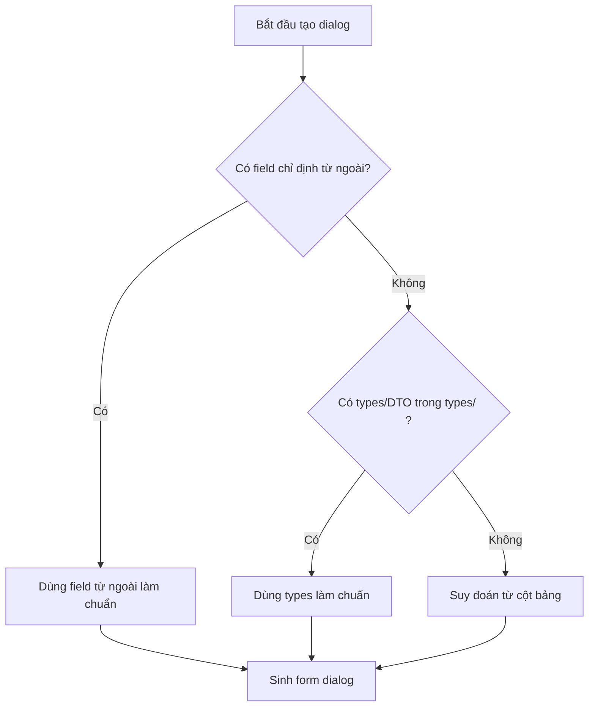

# Tạo Trang Số Dư Đầu Kỳ (SDDK) — SASUCO KetoanApp

> **Kế thừa toàn bộ:** `tao-master-page` (Pattern A/B/C/D, DmPageHeader, DmSearchToolbar, DmTable, ghost column, onDoubleClick).
> **Khác biệt chính so với master-page thông thường:**
> 1. **Không có `DmTablePagination`** ở cuối bảng → thay bằng dòng tổng số bản ghi.
> 2. **Nút action chính** trên toolbar không phải "Thêm" mà là **"Nhập số dư"**.
> 3. **Click "Nhập số dư"** → mở dialog nhập số dư tương ứng với bảng (tìm trong `/dialogs`).

---

## 0. Font Chữ Toàn Cục — TUYỆT ĐỐI Không Ghi Đè

**Global font:** `Inter` (ưu tiên 1) → `InterVariable` → `"Noto Sans"` → `"Open Sans"` → `sans-serif`

> ⚠️ **QUAN TRỌNG:** Font được khai báo tập trung trong `src/styles/globals.css` trên `body` và `html`. **KHÔNG BAO GIỜ** set `font-family` riêng cho bất kỳ element nào trong bảng SDDK (`DmTable`, `DmTableHead`, `DmTableCell`, `th`, `td`, `input`, `button`). Tất cả element kế thừa font từ `body`.

**Nguyên nhân font trong bảng đôi khi khác:**
1. Tailwind v4 dùng `@theme` CSS thay vì `tailwind.config.js` — nếu `--font-sans` không được khai báo trong `@theme inline`, Tailwind fallback về `ui-sans-serif` (Segoe UI trên Windows) thay vì Inter.
2. `font-family` bị set cục bộ trên một component nào đó ghi đè global.

**Quy tắc:**
- ❌ **CẤM:** `className='font-sans'`, `style={{ fontFamily: '...' }}`, hoặc bất kỳ CSS `font-family` nào trên table/dialog/page
- ✅ **ĐÚNG:** Không set `font-family` — để element tự kế thừa từ `body`
- ✅ Nếu component bắt buộc cần font vì bị reset (vd: `button`, `input` trong một số browser): dùng `font-family: inherit`

---

## 1. Mapping Bảng → Dialog

Mỗi bảng SDDK (tương ứng với một tab/segment) có một dialog CRUD riêng trong thư mục `dialogs/`:

| Bảng (Component) | Dialog | Ghi chú |
|---|---|---|
| Số dư tài khoản | `SDDKSoDuTaiKhoanDialog` | Dạng cây, có nút mở rộng/thu gọn |
| Số dư TK ngân hàng | `SDDKSoDuTkNganHangDialog` | Bảng phẳng |
| Công nợ khách hàng | `SDDKCongNoKhachHangDialog` | Bảng phẳng |
| Công nợ nhà cung cấp | `SDDKCongNoNhaCungCapDialog` | Bảng phẳng |
| Công nợ nhân viên | `SDDKCongNoNhanVienDialog` | Bảng phẳng |
| Tồn kho vật tư hàng hóa | `SDDKTonKhoVatTuHangHoaDialog` | Bảng phẳng |

### 1.1 Quy tắc tìm dialog

Khi tạo/sửa bảng SDDK, tìm dialog tương ứng trong `src/modules/KetoanApp/features/nghiep-vu/so-du-dau-ky/dialogs/`:

```
dialogs/
├── SDDKSoDuTaiKhoanDialog.tsx       ← Số dư tài khoản
├── SDDKSoDuTkNganHangDialog.tsx     ← Số dư TK ngân hàng
├── SDDKCongNoKhachHangDialog.tsx    ← Công nợ khách hàng
├── SDDKCongNoNhaCungCapDialog.tsx   ← Công nợ nhà cung cấp
├── SDDKCongNoNhanVienDialog.tsx     ← Công nợ nhân viên
├── SDDKTonKhoVatTuHangHoaDialog.tsx ← Tồn kho vật tư hàng hóa
├── SDDKNhapSoDuDialog.tsx           ← Nhập số dư hàng loạt (full-screen)
├── SDDKNhapDuLieuDialog.tsx         ← Import Excel
├── SDDKCpDoDangDialog.tsx           ← CP dở dang (nếu có)
└── index.ts                         ← Barrel export
```

> **Nếu không tìm thấy dialog phù hợp với bảng → DỪNG LẠI và hỏi user:**
> _"Bảng `{tên bảng}` chưa có dialog nhập số dư trong `/dialogs`. Bạn có muốn tạo dialog mới không?"_

---

## 2. Cấu Trúc Chung Một Bảng SDDK

Mỗi bảng SDDK là một **component riêng** (`comSoDuDauKy.page.{TenBang}.tsx`) được nhúng vào `SoDuDauKyPage.tsx` qua từng tab.

```
SoDuDauKyPage.tsx (Page chính)
├── Sticky Header (breadcrumb + title + SpecialBar)
├── Tabs (cuộn ngang)
│   ├── Tab "Số dư tài khoản"     → ComSoDuDauKyPageAccountsTable
│   ├── Tab "Số dư TK ngân hàng"  → ComSoDuDauKyPageBankTable
│   ├── Tab "Công nợ khách hàng"  → ComSoDuDauKyPageCustomersTable
│   ├── Tab "Công nợ nhà cung cấp"→ ComSoDuDauKyPageVendorsTable
│   ├── Tab "Công nợ nhân viên"   → ComSoDuDauKyPageEmployeesTable
│   └── Tab "Tồn kho VTHH"        → ComSoDuDauKyPageInventoriesTable
├── Dialog Import Excel
├── Dialog Nhập số dư hàng loạt
└── Dialog Kết quả kiểm tra cân bằng
```

### 2.1 Cấu trúc component bảng SDDK

```tsx
export function ComSoDuDauKyPage{Name}Table({ tab, listState, keyword, ... }: Props) {
  // === State quản lý dialog CRUD ===
  const [dialogOpen, setDialogOpen] = useState(false)
  const [dialogMode, setDialogMode] = useState<DialogMode>('create')
  const [dialogData, setDialogData] = useState<SoDuDauKyFormState | null>(null)

  // === Hook form (từ useSoDuDauKyForm) ===
  const formHook = useSoDuDauKyForm({
    segment: tab.segment,
    initialData: dialogData,
    mode: dialogMode,
    onSuccess: onRefetch,
    onClose: () => setDialogOpen(false),
  })

  // === Handler ===
  const handleCreate = useCallback(() => {
    setDialogMode('create')
    setDialogData(null)
    setDialogOpen(true)
  }, [])

  const handleEdit = useCallback((item) => {
    setDialogMode('edit')
    setDialogData(item)
    setDialogOpen(true)
  }, [])

  return (
    <div className='space-y-0'>
      {/* Search Toolbar với nút "Nhập số dư" */}
      <DmSearchToolbar
        search={keyword}
        onSearchChange={onKeywordChange}
        extraActions={
          <>
            <Button ... onClick={onRefresh}>  {/* Làm mới */}
              <RefreshCw />
            </Button>
            <Button ... onClick={handleCreate}>  {/* Nhập số dư */}
              <Plus />Nhập số dư
            </Button>
          </>
        }
      />

      {/* Bảng dữ liệu */}
      <DmTable>...</DmTable>

      {/* Tổng số bản ghi — KHÔNG dùng DmTablePagination */}
      <div className='px-4 py-3 border-t border-[#e0e0e0] text-sm text-gray-600'>
        Tổng số: <span className='font-semibold text-gray-900'>{total}</span> bản ghi
      </div>

      {/* Dialog CRUD */}
      <{Name}Dialog open={dialogOpen} ... />

      {/* ConfirmDialog xóa */}
      <ConfirmDialog ... />
    </div>
  )
}
```

### 2.2 Dialog Dùng Chung Cho Cả Tạo & Sửa (BẮT BUỘC)

**Nguyên tắc cốt lõi:** Nhập số dư (Create) và Sửa (Edit) dùng **CÙNG MỘT dialog component** từ `/dialogs/`. Không tạo 2 dialog riêng biệt.

Điểm khác biệt duy nhất giữa Nhập số dư và Sửa:
| | Nhập số dư (Create) | Sửa (Edit) |
|---|---|---|
| `mode` | `'create'` | `'edit'` |
| `dialogData` | `null` | item được chọn |
| Form hiển thị | Form trống | Form được fill sẵn data |

```tsx
// ✅ ĐÚNG: 1 dialog, 2 mode
const handleCreate = useCallback(() => {
  setDialogMode('create')
  setDialogData(null)              // ← không có data
  setDialogOpen(true)
}, [])

const handleEdit = useCallback((item) => {
  setDialogMode('edit')
  setDialogData(item)              // ← fill data từ row được chọn
  setDialogOpen(true)
}, [])

// JSX: chỉ 1 dialog duy nhất
<SoDuDauKyXxxDialog
  open={dialogOpen}
  onOpenChange={setDialogOpen}
  mode={dialogMode}
  formData={formHook.formData}
  ...
/>
```

```tsx
// ❌ SAI: 2 dialog riêng cho Nhập số dư và Sửa
<SoDuDauKyXxxCreateDialog ... />
<SoDuDauKyXxxEditDialog ... />
```

**Trong dialog component**, dùng `mode` để phân biệt:
- `mode === 'create'` → gọi API `create()`, form rỗng, title "Nhập số dư"
- `mode === 'edit'`   → gọi API `update()`, form fill từ `initialData`, title "Sửa số dư"

#### ⚠️ Map DTO → FormState — Tránh `as unknown as`

**🚫 TUYỆT ĐỐI CẤM** dùng `item as unknown as SoDuDauKyFormState` khi truyền data từ row vào dialog Edit.

**Lý do:** Tên field giữa DTO (API response) và `SoDuDauKyFormState` (dialog form) thường **khác nhau**:

| Bảng | DTO field | FormState field |
|------|-----------|----------------|
| TK Tổng hợp | `debitAmount` | `debitAmount` |
| TK Tổng hợp | `creditAmount` | `creditAmount` |
| TK Tổng hợp | `accountObjectID` | `accountObjectId` |
| TK Ngân hàng | `debitAmount` | `debitAmount` |
| TK Ngân hàng | `creditAmount` | `creditAmount` |
| Công nợ KH | `customerCode` | `objectCode` |
| Công nợ KH | `customerName` | `objectName` |
| Công nợ NCC | `vendorCode` | `objectCode` |
| Công nợ NV | `employeeCode` | `objectCode` |

**Pattern đúng — Map thủ công từng field:**

```tsx
// ✅ ĐÚNG: Map từng field từ DTO → FormState
const handleEdit = useCallback((item: OpeningAccountEntryOtherResponse) => {
  setDialogMode('edit')
  setDialogData({
    id: item.id,
    refDate: item.refDate?.slice(0, 10) ?? '',
    accountNumber: item.accountNumber ?? '',
    accountObjectId: item.accountObjectID ?? undefined,
    accountObjectCode: item.accountObjectCode ?? undefined,
    accountObjectName: item.accountObjectName ?? undefined,
    debitAmount: item.debitAmount,       // ← DTO debitAmount → FormState debitAmount (cùng tên)
    creditAmount: item.creditAmount,     // ← DTO creditAmount → FormState creditAmount (cùng tên)
  } as SoDuDauKyFormState)
  setDialogOpen(true)
}, [])
```

```tsx
// ❌ SAI: Ép kiểu không map field — form nhận undefined!
const handleEdit = useCallback((item: OpeningAccountEntryOtherResponse) => {
  setDialogData(item as unknown as SoDuDauKyFormState)  // ← KHÔNG map field!
  setDialogOpen(true)
}, [])
```

**Quy tắc:**
- Luôn kiểm tra tên field giữa DTO và `SoDuDauKyFormState`
- Nếu khác tên → map thủ công với comment mapping
- Viết comment `// ← DTO xxx → FormState yyy` cho từng field khác tên
- Tham số `handleEdit` nên dùng đúng kiểu DTO (vd: `OpeningAccountEntryOtherResponse`), không dùng `SoDuDauKyFormState`

> Xem chi tiết pattern Edit/Nhân bản trong memory `edit-form-pattern.md`.

### 2.3 ⚠️ Quy Tắc Ưu Tiên Field Trong Dialog

Khi tạo dialog cho bảng SDDK, các field hiển thị trong form được xác định theo thứ tự ưu tiên sau:

| Ưu tiên | Nguồn field | Mô tả |
|---------|------------|-------|
| **1 (cao nhất)** | **Cung cấp từ ngoài vào** | User hoặc task inbox chỉ định rõ danh sách field cần có trong dialog (tên field, label, kiểu dữ liệu, thứ tự). Đây là nguồn quyết định cuối cùng. |
| **2** | **Types/DTO từ API** | Nếu không có danh sách field từ ngoài, dùng types đã định nghĩa trong `types/` (vd: `SoDuDauKyFormState`, DTO response từ API) để suy ra danh sách field. |
| **3 (thấp nhất)** | **Suy đoán từ bảng** | Dùng cấu trúc cột của bảng SDDK để suy ra field cần có trong dialog. Chỉ dùng khi không có cả 2 nguồn trên. |



**Ví dụ:**
- User nói: _"Dialog cần các field: Số tài khoản, Tên tài khoản, Dư nợ, Dư có, Đối tượng"_ → dùng đúng 5 field này, bỏ qua types nếu types có thêm field khác.
- User nói: _"Tạo dialog nhập số dư cho bảng Công nợ khách hàng"_ (không chỉ định field) → dùng `SoDuDauKyFormState` trong `types/` để lấy danh sách field.

> **Nguyên tắc:** Khi có mâu thuẫn giữa field từ ngoài và field từ types → **field từ ngoài thắng**. Các field có trong types nhưng không có trong danh sách từ ngoài → **bỏ qua**, không thêm vào dialog.

---

## 3. Khác Biệt So Với `tao-master-page`

### 3.1 ❌ KHÔNG có `DmTablePagination`

**SAI (master-page thường):**
```tsx
<DmTablePagination
  total={total} page={page} limit={limit}
  onPageChange={onPageChange} onLimitChange={onLimitChange}
/>
```

**ĐÚNG (SDDK page):**
```tsx
<div className='px-4 py-3 border-t border-[#e0e0e0] text-sm text-gray-600'>
  Tổng số: <span className='font-semibold text-gray-900'>{total}</span> bản ghi
</div>
```

> **Lý do:** Số dư đầu kỳ thường có ít bản ghi, không cần phân trang. Nếu cần phân trang (vd: hàng trăm bản ghi), hỏi user.

### 3.1b ✅ BẮT BUỘC có scroll ngang (`overflow-auto`)

**Tất cả bảng SDDK PHẢI có scroll ngang.** Bọc `DmTable` trong `<div className='overflow-auto'>`:

**ĐÚNG:**
```tsx
<div className='overflow-auto'>
  <DmTable style={{ minWidth: minTableWidth }} ...>
    ...
  </DmTable>
</div>
```

**SAI:**
```tsx
// ❌ Không scroll ngang → bảng bị tràn màn hình nhỏ
<DmTable ...>...</DmTable>

// ❌ Có overflow nhưng ẩn scrollbar → user không biết có thể scroll
<div className='overflow-auto scrollbar-hidden'>
  <DmTable ...>...</DmTable>
</div>
```

> **Quy tắc:** Luôn dùng `overflow-auto` **KHÔNG** kèm `scrollbar-hidden`. Đặt `minWidth` từ `COL_WIDTHS` để bảng không bị co hẹp quá mức.

### 3.1d ❌ KHÔNG bo góc (`rounded-lg`) cho wrapper bảng

**Wrapper bọc `DmTable` KHÔNG được có `rounded-lg`, `bg-white`, `border`, `overflow-hidden`.** Bảng SDDK không cần bo góc — bo góc tạo cảm giác bảng bị cắt, không liền mạch với layout xung quanh. So với danh mục, bảng SDDK cần giao diện phẳng, gọn gàng.

**ĐÚNG:**
```tsx
<div className='overflow-auto'>
  <DmTable style={{ minWidth: minTableWidth }} ...>
    ...
  </DmTable>
</div>
```

**SAI:**
```tsx
// ❌ Không dùng rounded-lg, bg-white, border, overflow-hidden cho wrapper
<div className='bg-white rounded-lg border border-[#e0e0e0] overflow-hidden'>
  <div className='overflow-auto'>
    <DmTable ...>...</DmTable>
  </div>
</div>
```

> **Quy tắc:** Chỉ dùng `<div className='overflow-auto'>` làm wrapper duy nhất cho `DmTable` — **KHÔNG** thêm `rounded-lg`, `bg-white`, `border`, `overflow-hidden`, hoặc wrapper lồng nhau.

### 3.1c ✅ BẮT BUỘC có dòng tổng (sum row) trong `DmTableBody`

**Tất cả bảng SDDK PHẢI có dòng tổng ở cuối `DmTableBody`.** Dòng này tính tổng các cột số (dư nợ, dư có, số lượng tồn...).

**Cách làm:**
1. Thêm `useMemo` import
2. Tính tổng các cột số từ `typedItems`
3. Thêm `<DmTableRow>` cuối cùng trong `<DmTableBody>` (sau `items.map()`), với `className='bg-[#ECEDEF] font-semibold hover:bg-[#ECEDEF]'`
4. Các ô không phải số để trống; ô chứa chữ "Tổng" đặt ở cột text cuối cùng trước cột số; ô số dùng `className='text-right font-semibold text-black'`

**Ví dụ (công nợ có dư nợ + dư có):**
```tsx
// Tính tổng
const { sumDebit, sumCredit } = useMemo(() => {
  let sumDebit = 0
  let sumCredit = 0
  for (const item of typedItems) {
    sumDebit += item.debitAmount ?? 0
    sumCredit += item.creditAmount ?? 0
  }
  return { sumDebit, sumCredit }
}, [typedItems])

// Trong DmTableBody, sau items.map():
<DmTableRow className='bg-[#ECEDEF] font-semibold hover:bg-[#ECEDEF]'>
  <DmTableCell style={{ width: COL_WIDTHS.col1 }} className='border-r-0' />
  <DmTableCell style={{ width: COL_WIDTHS.col2 }} className='border-r-0' />
  <DmTableCell style={{ width: COL_WIDTHS.col3 }} className='font-semibold text-black border-r-0'>Tổng</DmTableCell>
  <DmTableCell style={{ width: COL_WIDTHS.debit }} className='text-right font-semibold text-black'>
    {fmt(sumDebit)}
  </DmTableCell>
  <DmTableCell style={{ width: COL_WIDTHS.credit }} className='text-right font-semibold text-black'>
    {fmt(sumCredit)}
  </DmTableCell>
  <DmTableCell style={{ width: 0, minWidth: 0, padding: 0, border: 'none' }} />
</DmTableRow>
```

**Ví dụ (tồn kho chỉ có số lượng):**
```tsx
const sumQuantity = useMemo(() => {
  let sum = 0
  for (const item of typedItems) { sum += item.quantity ?? 0 }
  return sum
}, [typedItems])

<DmTableRow className='bg-[#ECEDEF] font-semibold hover:bg-[#ECEDEF]'>
  <DmTableCell style={{ width: COL_WIDTHS.itemCode }} className='border-r-0' />
  {/* ... các cột text để trống (đều có border-r-0) */}
  <DmTableCell style={{ width: COL_WIDTHS.warehouseCode }} className='font-semibold text-black border-r-0'>Tổng</DmTableCell>
  <DmTableCell style={{ width: COL_WIDTHS.quantity }} className='text-right font-semibold text-black'>
    {fmt(sumQuantity)}
  </DmTableCell>
  <DmTableCell style={{ width: 0, minWidth: 0, padding: 0, border: 'none' }} />
</DmTableRow>
```

> **Nguyên tắc:**
> - Dòng tổng luôn nằm TRONG `DmTableBody`, SAU `items.map()`, TRƯỚC khi đóng `</DmTableBody>`
> - Ô "Tổng" đặt ở cột cuối cùng bên trái của các cột số (thường là cột text cuối cùng: tên đối tượng, mã kho...)
> - Các ô trống dùng `<DmTableCell style={{ width: COL_WIDTHS.xxx }} />` (không có children)
> - Import `fmt` helper: `const fmt = (n: number) => new Intl.NumberFormat('vi-VN').format(n)`
> - KHÔNG hiển thị dòng tổng khi `loading` hoặc `items.length === 0`
> - **Ô trống và ô chữ "Tổng" PHẢI có `className='border-r-0'`** để xóa border-right thừa. **Chỉ giữ border-r ở các ô chứa giá trị số** (Dư nợ, Dư có, Số lượng tồn, Giá trị tồn).

### 3.2 ✅ Nút action là "Nhập số dư" (không phải "Thêm")

**SAI:**
```tsx
<Button className='btn-primary' onClick={handleCreate}>Thêm</Button>
```

**ĐÚNG:**
```tsx
<Button className='btn-primary h-8 text-sm px-3' data-qa='btn_nhap_so_du' onClick={handleCreate}>
  <Plus className='h-4 w-4 mr-1' />Nhập số dư
</Button>
```

- `data-qa` luôn là `btn_nhap_so_du`
- Icon: `Plus` từ lucide-react
- Nút nằm trong `extraActions` của `DmSearchToolbar`, **KHÔNG** nằm trong `DmPageHeader.actions`

### 3.3 ✅ Không dùng `DmPageHeader`

SDDK page có header riêng (sticky, breadcrumb, title, SpecialBar). Các component bảng con **không** dùng `DmPageHeader` — chỉ render bảng + toolbar.

### 3.4 ✅ Dialog nằm trong từng component bảng con

Mỗi component bảng con tự quản lý dialog CRUD của nó (không đặt chung ở page). Dialog được import từ `../dialogs/`:

```tsx
import { SoDuDauKyBankDialog } from '../dialogs/SDDKSoDuTkNganHangDialog'
```

### 3.5 ✅ Dùng chung `useSoDuDauKyForm` hook

Tất cả bảng SDDK dùng chung một hook form `useSoDuDauKyForm` (không tạo hook riêng cho từng bảng trừ khi có logic đặc thù).

```tsx
import { useSoDuDauKyForm } from '../hooks/useSoDuDauKy.dlg.form'

const formHook = useSoDuDauKyForm({
  segment: tab.segment,      // ← xác định loại số dư (accounts, bank, customers, ...)
  initialData: dialogData,
  mode: dialogMode,
  onSuccess: onRefetch,
  onClose: () => setDialogOpen(false),
})
```

### 3.6 ✅ Cột số tiền/số lượng: Title căn phải (`text-right`)

**Tất cả các cột hiển thị số tiền hoặc số lượng trong bảng SDDK PHẢI có title căn phải (bên phải của bảng).**

| Cột | `className` trên `<DmTableHead>` | `className` trên `<DmTableCell>` |
|-----|----------------------------------|----------------------------------|
| Dư nợ | `className='text-right'` | `className='text-right font-medium'` |
| Dư có | `className='text-right'` | `className='text-right font-medium'` |
| Số lượng tồn | `className='text-right'` | `className='text-right font-medium'` |
| Dòng tổng cộng | _(không có)_ | `className='text-right font-semibold text-black'` |

**ĐÚNG:**
```tsx
<DmTableHead style={{ width: COL_WIDTHS.debit }} className='text-right'>Dư nợ</DmTableHead>
<DmTableHead style={{ width: COL_WIDTHS.credit }} className='text-right'>Dư có</DmTableHead>
```

**SAI:**
```tsx
<DmTableHead style={{ width: COL_WIDTHS.debit }}>Dư nợ</DmTableHead>   // ← Thiếu text-right!
<DmTableHead style={{ width: COL_WIDTHS.credit }}>Dư có</DmTableHead>   // ← Thiếu text-right!
```

> **Nguyên tắc:** Các cột chứa giá trị số (tiền tệ, số lượng) luôn căn phải cả title lẫn data cell để user dễ đọc và so sánh.

---

## 4. Pattern Bảng SDDK

### 4.1 Bảng phẳng (VD: TK ngân hàng, Công nợ KH, Công nợ NCC, Công nợ NV, Tồn kho VTHH)

```tsx
const COL_WIDTHS = { col1: 200, col2: 250, col3: 200, debit: 160, credit: 160 }
const minTableWidth = Object.values(COL_WIDTHS).reduce((a, b) => a + b, 0)

return (
  <div className='space-y-0'>
    <DmSearchToolbar
      search={keyword}
      onSearchChange={onKeywordChange}
      extraActions={
        <>
          <Button variant='ghost' size='sm'
            className='h-8 w-8 p-0 border rounded-md text-gray-500 hover:text-gray-700 hover:bg-gray-100'
            onClick={onRefresh} disabled={refreshing} title='Làm mới'
            data-qa='btn_lam_moi'>
            <RefreshCw className={cn('h-4 w-4', refreshing && 'animate-spin')} />
          </Button>
          <Button variant='ghost' size='sm'
            className='h-8 w-8 p-0 border rounded-md text-gray-500 hover:text-gray-700 hover:bg-gray-100'
            title='Xuất Excel'
            data-qa='btn_export'>
            <FileDown className='h-4 w-4' />
          </Button>
          <Button className='btn-primary h-8 text-sm px-3' data-qa='btn_nhap_so_du' onClick={handleCreate}>
            <Plus className='h-4 w-4 mr-1' />Nhập số dư
          </Button>
        </>
      }
    />

    <div className='overflow-auto'>
      <DmTable style={{ minWidth: minTableWidth }} data-qa='tbl_so_du_xxx'>
        <DmTableHeader>
          <DmTableHeaderRow>
            <DmTableHead style={{ width: COL_WIDTHS.col1 }}>Cột 1</DmTableHead>
            <DmTableHead style={{ width: COL_WIDTHS.col2 }}>Cột 2</DmTableHead>
            {/* ... */}
            <DmTableHead style={{ width: COL_WIDTHS.debit }} className='text-right'>Dư nợ</DmTableHead>
            <DmTableHead style={{ width: COL_WIDTHS.credit }} className='text-right'>Dư có</DmTableHead>
            {/* Ghost action column */}
            <DmTableHead className='sticky right-0 z-30 bg-[#ECEDEF]'
              style={{ width: 0, minWidth: 0, padding: 0, border: 'none' }} />
          </DmTableHeaderRow>
        </DmTableHeader>
        <DmTableBody>
          {loading ? (
            <DmTableRow>
              <DmTableCell colSpan={5} className='text-center py-12 text-gray-400'>Đang tải dữ liệu...</DmTableCell>
            </DmTableRow>
          ) : items.length === 0 ? (
            <DmTableRow>
              <DmTableCell colSpan={5} className='text-center py-12 text-gray-400'>Không có dữ liệu</DmTableCell>
            </DmTableRow>
          ) : items.map(item => (
            <DmTableRow key={item.id} data-qa='sd-xxx-row' className='group'
              onDoubleClick={() => handleEdit(item)}>
              {/* Data cells */}
              <DmTableCell style={{ width: COL_WIDTHS.col1 }} className='font-medium text-black'>
                {item.field1 || ''}
              </DmTableCell>
              {/* ... */}
              <DmTableCell style={{ width: COL_WIDTHS.debit }} className='text-right font-medium'>
                {formatCurrency(item.debitAmount ?? 0)}
              </DmTableCell>
              <DmTableCell style={{ width: COL_WIDTHS.credit }} className='text-right font-medium'>
                {formatCurrency(item.creditAmount ?? 0)}
              </DmTableCell>
              {/* Ghost action column */}
              <DmTableCell className='sticky right-0 z-20 bg-transparent'
                style={{ width: 0, minWidth: 0, padding: 0, border: 'none', overflow: 'visible' }}>
                <div className='absolute right-0 top-0 bottom-0 flex items-center gap-0.5 opacity-0 group-hover:opacity-100 transition-opacity duration-150 bg-gradient-to-l from-white via-white/90 to-transparent pl-16 pr-2'>
                  <Button variant='ghost' size='sm' className='icon-warning border rounded-lg bg-white'
                    title='Sửa' data-qa={`btn_sua_${item.id}`} onClick={() => handleEdit(item)}>
                    <Pencil className='h-4 w-4' />
                  </Button>
                  <Button variant='ghost' size='sm' className='icon-danger border rounded-lg bg-white'
                    title='Xóa' data-qa={`btn_xoa_${item.id}`}
                    onClick={() => { setDelId(item.id); setDelOpen(true) }}>
                    <Trash2 className='h-4 w-4' />
                  </Button>
                </div>
              </DmTableCell>
            </DmTableRow>
          ))}
          {/* Dòng tổng (BẮT BUỘC) */}
          <DmTableRow className='bg-[#ECEDEF] font-semibold hover:bg-[#ECEDEF]'>
            <DmTableCell style={{ width: COL_WIDTHS.col1 }} className='border-r-0' />
            <DmTableCell style={{ width: COL_WIDTHS.col2 }} className='border-r-0' />
            <DmTableCell style={{ width: COL_WIDTHS.col3 }} className='font-semibold text-black border-r-0'>Tổng</DmTableCell>
            <DmTableCell style={{ width: COL_WIDTHS.debit }} className='text-right font-semibold text-black'>
              {fmt(sumDebit)}
            </DmTableCell>
            <DmTableCell style={{ width: COL_WIDTHS.credit }} className='text-right font-semibold text-black'>
              {fmt(sumCredit)}
            </DmTableCell>
            <DmTableCell style={{ width: 0, minWidth: 0, padding: 0, border: 'none' }} />
          </DmTableRow>
        </DmTableBody>
      </DmTable>
    </div>

    {/* Tổng số — KHÔNG phân trang */}
    <div className='px-4 py-3 border-t border-[#e0e0e0] text-sm text-gray-600'>
      Tổng số: <span className='font-semibold text-gray-900'>{total}</span> bản ghi
    </div>

    {/* ConfirmDialog xóa — XEM CHI TIẾT Ở SECTION 4.3 */}
    <ConfirmDialog
      open={delOpen}
      onOpenChange={setDelOpen}
      onConfirm={handleDeleteConfirm}
      title='Xác nhận xóa'
      message='Bạn có chắc muốn xóa bản ghi số dư này?'
      variant='destructive'
      loading={deleting}
    />

    {/* Dialog CRUD */}
    <{Name}Dialog
      open={dialogOpen}
      onOpenChange={setDialogOpen}
      mode={dialogMode}
      formData={formHook.formData}
      errors={formHook.errors}
      touched={formHook.touched}
      submitting={formHook.submitting}
      serverError={formHook.serverError}
      serverErrorOpen={formHook.serverErrorOpen}
      onServerErrorOpenChange={formHook.setServerErrorOpen}
      onFieldChange={(field, value) => formHook.setFormData(prev => ({ ...prev, [field]: value }))}
      onBlur={formHook.handleBlur}
      onSubmit={formHook.handleSubmit}
    />
  </div>
)
```

### 4.2 Bảng dạng cây (VD: Số dư tài khoản)

Giống bảng phẳng nhưng thêm:
- `buildTree()` và `flattenTree()` để dựng cây từ danh sách phẳng
- Cột đầu tiên có nút `ChevronRight`/`ChevronDown` và indent `depth * 20px`
- `colSpan` là `5` (expand + 3 data + ghost action, không tính checkbox)

```tsx
// Cột expand
<DmTableCell style={{ width: COL_WIDTHS.expand }} className='text-center'>
  {hasChildren ? (
    <button className='inline-flex items-center justify-center w-6 h-6 rounded hover:bg-gray-200'
      onClick={() => toggleExpand(it.id)}>
      {node.expanded ? <ChevronDown className='h-4 w-4' /> : <ChevronRight className='h-4 w-4' />}
    </button>
  ) : null}
</DmTableCell>

// Cột đầu tiên có indent
<DmTableCell style={{ width: COL_WIDTHS.accountNumber, paddingLeft: node.depth * 20 + 8 }}
  className='font-medium text-black'>
  {it.accountNumber || ''}
</DmTableCell>
```

### 4.3 ⚠️ Implement Tính Năng Xóa (BẮT BUỘC)

**Khi tạo bảng SDDK có action Xóa, PHẢI implement đầy đủ logic gọi API xóa.** Không để `TODO` hay comment `// gọi API xóa` rỗng.

#### 4.3.1 Import bổ sung

```tsx
import { toast } from 'sonner'
import { SoDuDauKyApiService } from '../services'
```

#### 4.3.2 State

```tsx
const [delId, setDelId] = useState<string | null>(null)
const [delOpen, setDelOpen] = useState(false)
const [deleting, setDeleting] = useState(false)  // ← loading state cho ConfirmDialog
```

#### 4.3.3 Mapping Segment → API Delete Method

```tsx
const DELETE_METHODS: Record<string, (id: string) => Promise<ApiResponse<void>>> = {
  'accounts':      SoDuDauKyApiService.deleteAccount,
  'bank-accounts': SoDuDauKyApiService.deleteBankAccount,
  'customers':     SoDuDauKyApiService.deleteCustomer,
  'vendors':       SoDuDauKyApiService.deleteVendor,
  'employees':     SoDuDauKyApiService.deleteEmployee,
  'inventories':   SoDuDauKyApiService.deleteInventory,
  'wip':           SoDuDauKyApiService.deleteWip,
}
```

#### 4.3.4 Handler Xóa (gọi API + toast)

```tsx
const handleDeleteConfirm = useCallback(async () => {
  if (!delId) return
  setDeleting(true)
  try {
    const deleteFn = DELETE_METHODS[tab.segment]
    if (!deleteFn) {
      toast.error('Không tìm thấy API xóa cho loại số dư này')
      return
    }
    const res = await deleteFn(delId)
    if (res.success) {
      toast.success('Đã xóa bản ghi số dư')
      onRefetch()
    } else {
      toast.error((res.message as string) || 'Không thể xóa bản ghi số dư')
    }
  } catch {
    toast.error('Lỗi kết nối khi xóa bản ghi số dư')
  } finally {
    setDeleting(false)
    setDelOpen(false)
    setDelId(null)
  }
}, [delId, tab.segment, onRefetch])
```

#### 4.3.5 Nút Xóa Trong Hàng

```tsx
<Button variant='ghost' size='sm' className='icon-danger border rounded-lg bg-white'
  title='Xóa' data-qa={`btn_xoa_${item.id}`}
  onClick={() => { setDelId(item.id); setDelOpen(true) }}>
  <Trash2 className='h-4 w-4' />
</Button>
```

#### 4.3.6 Flow Đầy Đủ

```
Click icon 🗑️ → setDelId + setDelOpen → ConfirmDialog hiện
  → User click "Xác nhận" → handleDeleteConfirm()
    → setDeleting(true) → gọi API DELETE .../{id}
      → success → toast "Đã xóa..." → onRefetch()
      → fail → toast lỗi
    → finally: setDeleting(false), đóng dialog, reset delId
```

---

## 5. Props Interface Cho Component Bảng

```tsx
interface Props {
  tab: SoDuDauKyTabConfig           // Cấu hình tab (id, label, segment, refType)
  listState: PageListState          // State từ useSoDuDauKyPageList
  keyword: string                   // Từ khóa tìm kiếm
  onKeywordChange: (v: string) => void
  onSearch: () => void
  onRefresh: () => void
  onRefetch: () => void
  onPageChange: (page: number) => void
  onLimitChange: (limit: number) => void
  refreshing: boolean
  // (Tùy chọn) prop riêng cho từng bảng
  onAddImportBalance?: () => void   // Chỉ cho bảng Số dư tài khoản (mở dialog nhập hàng loạt)
}
```

---

## 6. Quy Trình Tạo/Sửa Bảng SDDK

### A. Tạo bảng mới

1. **Xác định segment** — thêm vào `SO_DU_DAU_KY_TABS` trong `types/` nếu chưa có
2. **Tìm dialog** trong `dialogs/` tương ứng với bảng
   - Có dialog → import và dùng
   - Không có → **hỏi user**: _"Bảng `{tên}` chưa có dialog. Bạn có muốn tạo dialog mới không?"_
3. **Tạo component bảng** `comSoDuDauKy.page.{TenBang}.tsx` trong `components/`
4. **Nhúng vào page** — thêm `<TabsContent>` mới trong `SoDuDauKyPage.tsx`
5. **Export** trong `components/index.ts`

### B. Sửa bảng có sẵn

1. **Xác định component** trong `components/`
2. **Áp dụng các quy tắc trên** (bỏ pagination nếu có, đảm bảo nút "Nhập số dư")
3. **Không thay đổi dialog** trừ khi có yêu cầu cụ thể

---

## 7. Check List SDDK Page

- [ ] Component bảng **KHÔNG** có `DmTablePagination` → thay bằng dòng "Tổng số: X bản ghi"
- [ ] Nút action là **"Nhập số dư"** (không phải "Thêm")
- [ ] Nút "Nhập số dư" nằm trong `DmSearchToolbar.extraActions`, không trong `DmPageHeader`
- [ ] Có nút **Làm mới** (RefreshCw) + nút **Xuất Excel** (FileDown) bên cạnh nút Nhập số dư
- [ ] `DmTableRow` có `onDoubleClick` mở form Edit
- [ ] Ghost action column (sticky right, width=0, opacity hover) với Sửa + Xóa
- [ ] **Wrapper bảng chỉ dùng `<div className='overflow-auto'>`, KHÔNG có `rounded-lg` / `bg-white` / `border`**
- [ ] **Ô trống và ô "Tổng" trong dòng tổng có `className='border-r-0'`, chỉ giữ border-r ở ô số**
- [ ] Có `data-qa='tbl_so_du_xxx'` trên DmTable
- [ ] Dialog được import từ `../dialogs/` tương ứng
- [ ] Dùng chung `useSoDuDauKyForm` hook
- [ ] **Có `ConfirmDialog` xác nhận xóa với `loading={deleting}`**
- [ ] **Handler xóa gọi đúng `SoDuDauKyApiService.deleteXxx(id)` theo segment**
- [ ] **Có `toast.success` / `toast.error` thông báo kết quả xóa**
- [ ] **Có `onRefetch()` sau khi xóa thành công để refresh danh sách**
- [ ] **Có `deleting` state để disable nút khi đang xóa**
- [ ] (Nếu bảng cây) Có nút ChevronRight/ChevronDown + indent `depth * 20px`
- [ ] **Title** cột Dư nợ / Dư có / Số lượng có `className='text-right'` (căn phải bảng)
- [ ] **Data cell** cột Dư nợ / Dư có / Số lượng có `className='text-right font-medium'`
- [ ] Cột Dư nợ / Dư có dùng `formatCurrency` hoặc `Intl.NumberFormat`
- [ ] `colSpan` đúng: số cột data + 1 (ghost action), không tính expand column nếu có
- [ ] **Field dialog ưu tiên: cung cấp từ ngoài > types > suy đoán từ bảng**
- [ ] **Nếu user chỉ định field cụ thể → chỉ dùng đúng các field đó, bỏ qua field thừa trong types**
- [ ] **Dialog dùng chung cho cả Nhập số dư (Create) và Sửa (Edit) — KHÔNG tạo 2 dialog riêng**
- [ ] **Map DTO → FormState thủ công từng field khi Edit (không dùng `as unknown as`)**

---

## 8. Import Mẫu Cho Component Bảng SDDK

```tsx
import { useState, useCallback, useMemo } from 'react'
import { Plus, RefreshCw, Pencil, Trash2, ChevronDown, ChevronRight, FileDown } from 'lucide-react'
import { toast } from 'sonner'
import { Button } from '@/shared/components/ui/button'
import { ConfirmDialog } from '@/shared/components/common'
import { formatCurrency } from '@/shared/utils'
import { cn } from '@/shared/components/ui/utils'
import {
  DmTable, DmTableHeader, DmTableHeaderRow, DmTableHead,
  DmTableBody, DmTableRow, DmTableCell,
  DmSearchToolbar,
} from '@/modules/KetoanApp/components'
import type { SoDuDauKyTabConfig, SoDuDauKyFormState, DialogMode } from '../types'
import type { PageListState } from '../hooks/useSoDuDauKy.page.list'
import { useSoDuDauKyForm } from '../hooks/useSoDuDauKy.dlg.form'
import { SoDuDauKyApiService } from '../services'
import { SoDuDauKyXxxDialog } from '../dialogs/SDDK_xxxDialog'
import { useExcelExport } from '@/shared/hooks'
import type { ColumnSetting } from '@/shared/hooks/useTableSettings'
```
