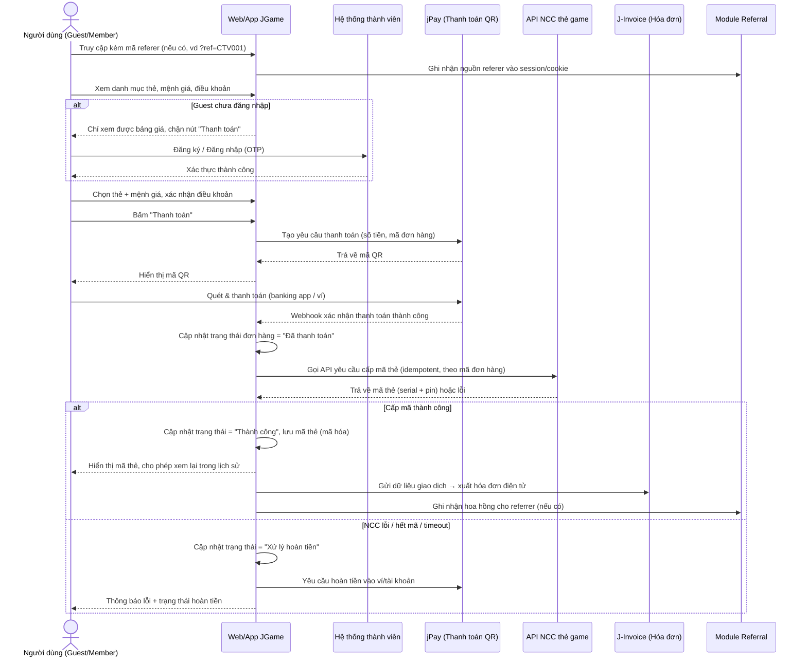
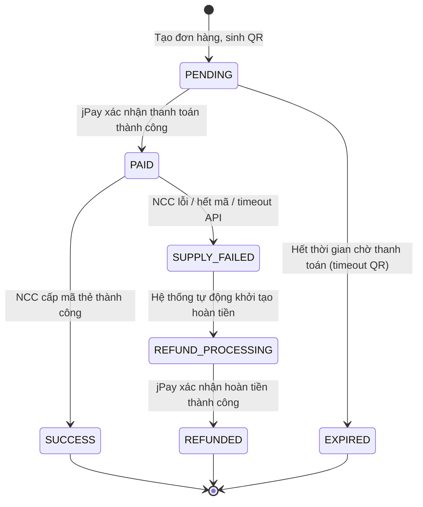
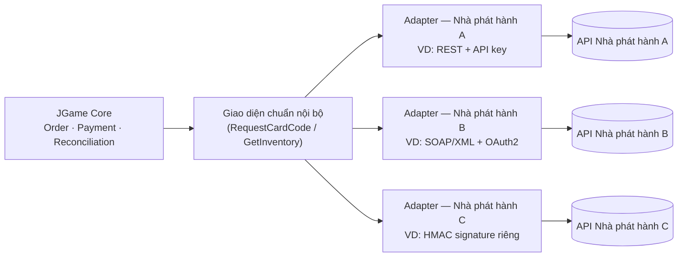
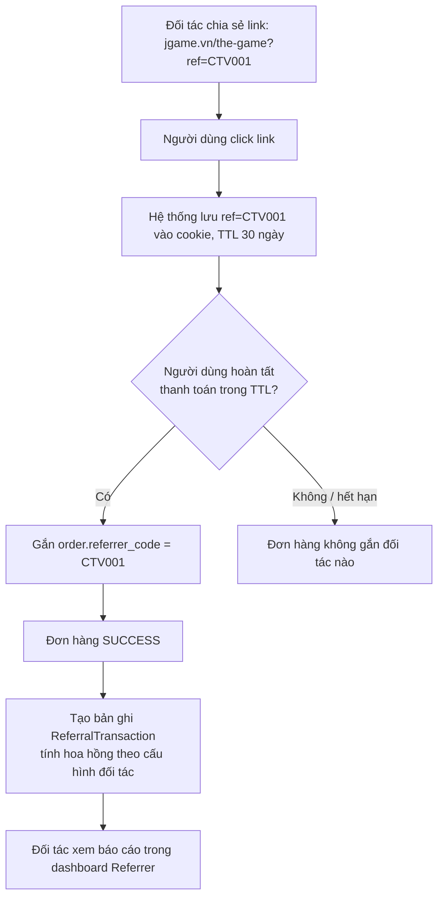
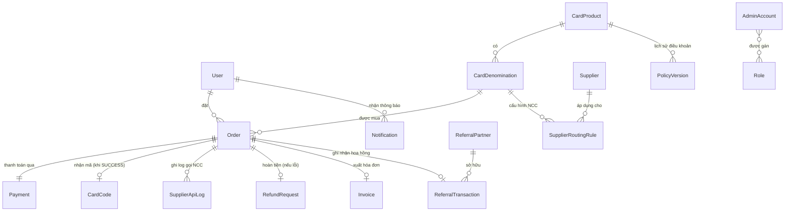

# URD — Tài Liệu Phân Tích Yêu Cầu Người Dùng: Nền Tảng JGame Store

> **Phiên bản:** 2.0 | **Ngày:** 2026-08-30
> **Trạng thái:** Đã cập nhật theo hiện trạng triển khai thực tế (xem mục 0.2) — vẫn cần rà soát khi có backend thật
> **Tài liệu liên quan:** [nen-tang-ket-noi-gamer.md](nen-tang-ket-noi-gamer.md) (ý tưởng kinh doanh gốc) · các tài liệu giải pháp triển khai trong [`../Nang-cap/`](../Nang-cap/) (nguồn xác nhận cho mục 0.2) · tài liệu nghiệp vụ/kiến trúc chi tiết tại `Website/.claude/business-rules/` và `Website/.claude/system-architect/`

---

## 0.2. CẬP NHẬT HIỆN TRẠNG TRIỂN KHAI (v2.0 — 2026-08-30)

> Mục này ghi đè các phần **lỗi thời** của bản v1.3 gốc (mục 1–23 giữ nguyên bên dưới làm tài liệu tham chiếu lịch sử/đặc tả gốc, nhưng khi có mâu thuẫn thì **mục này là đúng**). Nguồn xác nhận: 6 tài liệu giải pháp đã APPROVED trong `Docs/Nang-cap/` + khảo sát trực tiếp mã nguồn `src/modules/JGameApp/`.

### 0.2.1. Thay đổi lớn nhất: cả 3 giai đoạn + 1 nghiệp vụ mới đã được xây **song song**, không tuần tự theo đàm phán đối tác

URD gốc giả định GĐ2/GĐ3 chỉ triển khai **sau khi** GĐ1 ổn định và đàm phán API xong với NCC/NetBarBox/DoDoNew (mục 0, mục 14). Thực tế: toàn bộ GĐ1 (bán thẻ), GĐ2 (chợ vé cybergame), GĐ3 (phụ kiện gamer) **đã code đầy đủ giao diện + luồng nghiệp vụ**, cộng thêm 1 nghiệp vụ hoàn toàn mới **không có trong URD gốc — "Kiếm tiền" (nhiệm vụ trải nghiệm game + ví JCoin)**. Lý do làm được: **chưa có backend/đối tác thật nào** — toàn bộ hệ thống hiện chạy trên **mock giả lập phía frontend**, xem mục 0.2.2.

### 0.2.2. Toàn hệ thống hiện là Frontend + Mock — CHƯA có tích hợp thật nào

- Không có backend thật. Mọi API đi qua **1 gate mock duy nhất** `JGAME_USE_MOCK` (`shared/services/api/mockGate.ts`), bật/tắt qua `VITE_JGAME_USE_MOCK` (mặc định `true`). Khi có BE thật: set `VITE_JGAME_USE_MOCK=false` + `VITE_JGAME_API_URL` — không sửa code gọi ở page/hook (mỗi `ApiService` đã viết sẵn 2 nhánh cùng chữ ký `Promise<ApiResponse<T>>`).
- **Chưa tích hợp thật** với: jPay (QR giả lập bằng SVG pattern, không phải QR thật), J-Invoice, Zalo ZNS/SMS OTP, bất kỳ NCC thẻ game nào (Garena/VNG/...), NetBarBox/DoDoNew (nút "Đồng bộ ngay" chỉ random số liệu). Đây là **thay đổi phạm vi cần xác nhận lại**, không phải lỗi.
- Dữ liệu mock lưu 2 kiểu: **in-memory** (mất khi reload — đơn hàng thẻ/vé/phụ kiện, gian hàng, nhiệm vụ...) hoặc **localStorage** (tồn tại qua reload — tài khoản người dùng `jgame_auth_users_db`, lịch sử đăng nhập, giỏ hàng `jgame_cart`, giới hạn vé 0đ/tuần).
- Chi tiết kiến trúc mock đầy đủ: xem `Website/.claude/system-architect/mock-gate-va-api.md`.

### 0.2.3. Hệ thống tài khoản: KHÔNG dùng SSO, KHÔNG còn OTP-only — tự xây độc lập

URD gốc (mục 3, 6.1, 18.2) đặc tả đăng ký/đăng nhập bằng **OTP qua Zalo ZNS** (dự phòng SMS), không có khái niệm mật khẩu. Thực tế đã đổi hướng hoàn toàn:

- JGame là **website độc lập**, tự xây hệ thống tài khoản riêng — **không** dùng SSO chung nền tảng, không phụ thuộc `TokenManager`/`SsoApp`.
- Đăng ký: email + số điện thoại + **mật khẩu**. Đăng nhập: **chỉ số điện thoại** (đã chuẩn hoá, bỏ lựa chọn email/SĐT) + mật khẩu, có "Ghi nhớ đăng nhập".
- Có: quên mật khẩu / đặt lại mật khẩu (qua token), xác minh email (link token), xác minh số điện thoại (OTP mock), đổi mật khẩu, **2FA dạng TOTP mô phỏng** (mã demo cố định `123456`, không dựng QR thật), lịch sử đăng nhập & hoạt động (thời gian/thiết bị/IP mock/hành động).
- **Cảnh báo bảo mật đã ghi nhận trong code:** đây là mock phía FE — mật khẩu chỉ "obfuscate" bằng base64 trong `localStorage`, **không phải hash bảo mật thật**. Khi có BE thật, toàn bộ logic xác thực/băm mật khẩu PHẢI chuyển hẳn sang server.
- Chi tiết: `Website/.claude/business-rules/auth-tai-khoan.md`.

### 0.2.4. Mô hình vai trò thực tế: 1 role loại trừ (`admin`) + 2 "hồ sơ" không loại trừ

Khác mô hình RBAC nhiều vai trò cứng của URD gốc (mục 20). Thực tế (`AuthUser.role: 'customer' | 'admin'`):

| Vai trò | Cách xác định | Loại trừ với vai trò khác? |
|---|---|---|
| Khách hàng (Member) | Mọi tài khoản đăng ký, mặc định `role='customer'` | — |
| Quản trị viên (Admin) | `role='admin'` — gate cứng qua `RequireAdmin` | Có — 1 tài khoản chỉ có 1 role |
| **Chủ Cybergame (Cybergame Owner)** — actor mới GĐ2 | Có bản ghi `CybergameShop.ownerId = userId` (đăng ký qua "Chủ Cybergame") | **Không** — 1 Member vừa mua vừa mở gian hàng được (giống mô hình Shopee) |
| **Đối tác tiếp thị liên kết (Referrer/CTV)** | Có bản ghi `AffiliatePartner.userId = userId` (đăng ký qua "Trở thành đối tác") | **Không** — 1 Member có thể đồng thời là đối tác |

→ Điều này **trả lời thẳng câu hỏi mở ở mục 20 URD gốc** ("1 User có thể vừa là ReferralPartner không?") — câu trả lời thực tế là **CÓ**, và áp dụng luôn cho vai trò Chủ Cybergame.

4 tài khoản demo dựng sẵn (seed tự động khi load app lần đầu) để test nhanh từng vai trò: `khachhang@jgame.vn`, `chugianhang@jgame.vn`, `doitac@jgame.vn`, `admin@jgame.vn` (mật khẩu `Demo@123`). Đăng nhập xong tự điều hướng đúng khu vực: khách hàng → `/jgame/tai-khoan`, chủ Cybergame → `/jgame/chu-cybergame`, đối tác → `/jgame/doi-tac`, admin → `/jgame/quan-tri`.

### 0.2.5. Khu quản trị (Admin/SC-A*) nằm TRONG JGameApp, không phải AdminApp

URD gốc mục 17.2/18.6 giả định backoffice dùng chung hạ tầng Admin nội bộ tách biệt. Thực tế: vì JGame là site độc lập (mục 0.2.3), khu quản trị từng làm tạm trong `AdminApp/features/jgame/` đã được **chuyển hẳn vào chính JGameApp**, route `/jgame/quan-tri/*`, bảo vệ bởi `RequireAdmin`, layout riêng (`AdminLayout` trong `features/Account/Admin/`). `AdminApp` không còn route/menu nào liên quan JGame.

### 0.2.6. Cấu trúc thư mục: `features/Public` và `features/Account/{User,Admin,ShopOwner,Partner}`

Không còn cấu trúc phẳng theo domain (`features/catalog`, `features/order`...) như tài liệu giải pháp GĐ1 đầu tiên mô tả. Đã tái cấu trúc thành 2 vùng — **Public** (xem được không cần đăng nhập) và **Account** (chia 4 nhóm tài khoản: User/Admin/ShopOwner/Partner, mỗi nhóm có layout NavMenu sidebar riêng, độc lập hoàn toàn về code UI, không dùng chung 1 component layout). Chi tiết đầy đủ: `Website/.claude/system-architect/00-tong-quan-kien-truc.md`.

### 0.2.7. Giai đoạn 2 — Chợ vé giờ chơi Cybergame: đã triển khai đầy đủ (khác mô hình URD gốc)

URD gốc mục 7 chỉ đặc tả mức khung "đặt vé 0đ/săn vé". Thực tế đã xây thành **marketplace nhiều gian hàng kiểu Shopee** — mỗi phòng cybergame là 1 "gian hàng" (`CybergameShop`) có nhiều Zone (thường/VIP/cấu hình cao) và nhiều loại vé (`PlaytimeTicket`) theo số giờ, có flash-sale giảm sâu 70-90%, slot trống realtime (mock timer giảm dần). Kèm khu **Chủ Cybergame** đầy đủ cho Chủ Cybergame: đăng ký gian hàng, quản lý Zone/Vé, đồng bộ NetBarBox/DoDoNew (mock), quản lý đơn đã bán, đối soát công nợ. Đặc tả đầy đủ: `Website/.claude/business-rules/cho-ve-cybergame.md`.

### 0.2.8. Giai đoạn 3 — Kho phụ kiện Gamer: đã triển khai đầy đủ

URD gốc mục 8 chỉ đặc tả mức khung. Thực tế đã có catalog phụ kiện (chuột/bàn phím/tai nghe/PC/màn hình/ghế), giỏ hàng đa sản phẩm (`CartContext`, khác mô hình "1 đơn = 1 mệnh giá" của GĐ1 thẻ game), checkout kèm địa chỉ giao hàng + đơn vị vận chuyển, theo dõi đơn hàng vật lý (state machine riêng `PENDING→PAID→PACKING→SHIPPING→DELIVERED`/`CANCELLED`/`RETURNED`), và trang quản trị CRUD sản phẩm/đơn hàng. Đặc tả đầy đủ: `Website/.claude/business-rules/phu-kien-gamer.md`.

### 0.2.9. Nghiệp vụ hoàn toàn mới, KHÔNG có trong URD gốc: "Kiếm tiền" (nhiệm vụ + ví JCoin)

Đây là bổ sung ngoài phạm vi URD gốc, cần đưa vào lần rà soát BA tiếp theo. Tóm tắt: nhà phát hành game đăng "nhiệm vụ" (đạt cấp độ / chơi đủ giờ-ngày / sưu tập vật phẩm) trả thưởng bằng **JCoin** — tiền ảo nội bộ, **không rút được tiền mặt**, chỉ dùng để thanh toán một phần đơn hàng thẻ game / vé giờ chơi / phụ kiện. Đặc tả đầy đủ: `Website/.claude/business-rules/kiem-tien-jcoin.md`.

### 0.2.10. Trang chủ & điều hướng: đã đổi cấu trúc

Trang danh mục thẻ game (SC-01 gốc) không còn là trang chủ — đã chuyển sang `/jgame/nap-the` ("Nạp thẻ game"). Trang chủ mới `/jgame` là **trang hub** tổng hợp điểm nhấn cả 3 phân hệ (Nạp thẻ / Chợ vé / Phụ kiện), lấy dữ liệu thật từ chính 3 API tương ứng (không mock riêng).

### 0.2.11. Bảng tổng hợp route thực tế (thay thế mục 17 khi có mâu thuẫn)

Xem danh sách route đầy đủ, chính xác theo `src/modules/JGameApp/routes/routeConfig.tsx` tại `Website/.claude/system-architect/routing-va-layout.md` — đã bao gồm toàn bộ route GĐ1/GĐ2/GĐ3/Kiếm tiền/Tài khoản/Admin nêu trên, khác đáng kể so với bảng route ở mục 16 (Phụ lục) và mục 17 của bản gốc bên dưới.

### 0.2.12. Khoảng trống lớn nhất giữa URD và code — cần backend thật mới lộ ra

- **Backend trống hoàn toàn.** Repo `Backend/` chưa có bất kỳ commit nào liên quan JGame — không có gì để kế thừa, phải xây từ đầu đúng theo mục 18/19 URD (danh sách API, data dictionary) khi bắt tay code BE thật.
- **UC-13 (Đối soát JGame–NCC–jPay) và UC-14 (J-Invoice) — CHƯA có bất kỳ dòng code nào**, kể cả ở dạng mock UI. Đây là 2 khoảng trống lớn nhất, khác hẳn các nghiệp vụ khác (đã có mock UI đầy đủ) — cần đặc tả kỹ và ưu tiên khi thiết kế backend thật, vì hiện không có gì để tham chiếu ngoài URD gốc.
- **OTP hiện tại chỉ là `console.info` giả lập** (sinh số ngẫu nhiên, log ra console) — không có bất kỳ gateway Zalo ZNS/SMS thật nào đứng sau, kể cả ở mức thử nghiệm.
- **Phân quyền hiện tại chỉ so sánh chuỗi role đơn giản** (`user.role === 'admin'`) ở tầng route guard — chưa có mô hình permission theo từng hành động như các module khác trong InvoiceEasy; cần thiết kế lại khi có backend thật nếu muốn permission-based.

---

## 0. GHI CHÚ VỀ PHẠM VI TÀI LIỆU (bản gốc v1.3 — xem mục 0.2 để biết phần nào đã lỗi thời)

Tài liệu ý tưởng kinh doanh gốc mô tả JGame như một **marketplace hai chiều** giữa phòng game và game thủ (đặt chỗ, lấp ghế trống). Tài liệu URD này đặc tả một **nhánh sản phẩm cụ thể — "JGame Store"** — nền tảng thương mại điện tử bán hàng hóa số & vật lý cho cộng đồng gamer, dùng chung hạ tầng thành viên/ví/thanh toán/referral với sản phẩm chính. Ba nghiệp vụ trong nhánh này được triển khai theo lộ trình:

| Giai đoạn | Nghiệp vụ | Trạng thái ưu tiên |
|---|---|---|
| **Giai đoạn 1** | Bán thẻ game (mã thẻ nạp game từ các NCC) | **Trọng tâm — làm trước, MVP** |
| **Giai đoạn 2** | Bán vé giờ chơi cyberame (tích hợp realtime NetBarBox, DoDoNew...) | Sau khi Giai đoạn 1 ổn định |
| **Giai đoạn 3** | Kho hàng phụ kiện gamer (chuột, bàn phím, PC gaming...) | Mở rộng dài hạn |

Tài liệu đặc tả **chi tiết đầy đủ cho Giai đoạn 1**, đặc tả **ở mức khung (framework-level)** cho Giai đoạn 2 và 3 để làm cơ sở thiết kế chi tiết khi đến lượt triển khai.

**Tham chiếu ngoài:** napthe.vn được dùng làm điểm tham chiếu về mô hình bán thẻ cào/thẻ game trực tuyến tại Việt Nam (cơ chế chọn mệnh giá → thanh toán → nhận mã, phân cấp giá theo đại lý/CTV, API cho đối tác). Các điểm tương đồng được đưa vào business rule bên dưới; khuyến nghị đội BA khảo sát trực tiếp trải nghiệm mua hàng trên napthe.vn (và các sàn tương tự như thecao.vn, the9pay, gachthe123...) trước khi chốt đặc tả kỹ thuật, vì nội dung website có thể thay đổi theo thời gian.

**Ghi chú tên thương hiệu:** kể từ v1.3, sản phẩm được gọi là **JGame** (trước đó là "xGame"); tài liệu ý tưởng kinh doanh gốc [nen-tang-ket-noi-gamer.md](nen-tang-ket-noi-gamer.md) vẫn dùng tên gọi cũ "xGame" vì thuộc phạm vi tài liệu khác — cùng chỉ 1 sản phẩm.

### 0.1. Mức Độ Sẵn Sàng Để Làm Căn Cứ Thiết Kế Chi Tiết

Bản v1.0 (mục 1–16) đủ để **thống nhất phạm vi nghiệp vụ**, nhưng còn thiếu các lớp thông tin bắt buộc để đội thiết kế UI/UX, backend và database bắt tay làm tài liệu thiết kế chi tiết mà không phải quay lại hỏi BA. Bản v1.1 này bổ sung mục 17–22 để lấp các khoảng trống đó:

| Tài liệu thiết kế tiếp theo | Cần gì thêm ngoài URD gốc | Đã bổ sung tại |
|---|---|---|
| **Thiết kế màn hình (UI/UX)** | Danh sách màn hình cụ thể, thành phần/field trên từng màn hình, trạng thái hiển thị (loading/error/empty), điều hướng giữa các màn hình | Mục 17 |
| **Thiết kế backend** | Danh sách API/endpoint theo từng use case, actor gọi, input/output ở mức field, cơ chế xác thực, các tham số cấu hình cụ thể (timeout, retry, TTL...) thay vì chỉ mô tả nguyên tắc | Mục 18, 21, 22 |
| **Thiết kế database** | Đầy đủ thuộc tính + kiểu dữ liệu + khóa/quan hệ của từng bảng (ERD), các bảng còn thiếu ở bản gốc (phân quyền nội bộ, khuyến mãi, thông báo, cấu hình NCC, lịch sử điều khoản...) | Mục 19 (kèm sơ đồ ERD) |
| **Phân quyền hệ thống** | Ma trận quyền theo vai trò cho từng chức năng, tách bạch tài khoản khách hàng và tài khoản nhân sự nội bộ | Mục 20 |

> Các mục 17–22 vẫn ở mức **đặc tả yêu cầu (what)**, không đi vào giải pháp kỹ thuật cụ thể (which framework, table engine...) — đó là phạm vi của SRS/thiết kế kỹ thuật do đội dev thực hiện dựa trên tài liệu này.

---

## 1. GIỚI THIỆU TÀI LIỆU

### 1.1. Mục Đích

Tài liệu này mô tả **yêu cầu người dùng (user requirements)** cho việc xây dựng nền tảng JGame Store — làm cơ sở để:
- Đội Product/BA và stakeholder thống nhất phạm vi nghiệp vụ trước khi thiết kế kỹ thuật (SRS, database, API spec).
- Đội phát triển ước lượng effort, chia sprint, xây MVP Giai đoạn 1.
- Đối tác kỹ thuật (NCC thẻ game, cổng thanh toán jPay, hệ thống hóa đơn J-Invoice, nền tảng cybergame) hiểu rõ điểm tích hợp cần thiết.

### 1.2. Đối Tượng Đọc

Product Owner, Business Analyst, Kiến trúc sư giải pháp, Dev/QA team, đối tác NCC thẻ game, đối tác vận hành cybergame, ban điều hành.

### 1.3. Thuật Ngữ & Viết Tắt

| Thuật ngữ | Giải thích |
|---|---|
| URD | User Requirements Document — Tài liệu yêu cầu người dùng |
| NCC / Game Publisher | Nhà phát hành game — đơn vị phát hành mã thẻ game (Garena, VNG, Zing, telco...). Dùng thay thế cho nhau trong tài liệu này |
| Game Publisher Gateway | Lớp tích hợp của JGame với **nhiều** nhà phát hành game — vì mỗi nhà phát hành có kiểu API riêng nên cần chuẩn hóa qua Adapter (xem mục 11.3) |
| Adapter (Publisher Adapter) | Thành phần chuyển đổi giao diện API riêng của 1 nhà phát hành sang giao diện chuẩn nội bộ của JGame, để core nghiệp vụ không phụ thuộc vào cách từng đối tác thiết kế API |
| Nền tảng quản lý giờ chơi (Cybergame POS) | Hệ thống bán hàng/quản lý vận hành của phòng game (NetBarBox, DoDoNew...) — cung cấp dữ liệu ghế trống/giờ chơi realtime, nhận lệnh kích hoạt máy |
| Thành viên (Member) | Người dùng đã đăng ký & xác thực tài khoản trên JGame |
| Referrer / CTV | Đối tác tiếp thị được cấp mã giới thiệu riêng, hưởng hoa hồng trên giao dịch phát sinh từ nguồn của họ |
| jPay | Cổng thanh toán nội bộ nhóm — xử lý thanh toán QR, ví |
| J-Invoice | Nền tảng xuất hóa đơn điện tử tích hợp sẵn |
| GMV | Gross Merchandise Value — tổng giá trị giao dịch qua nền tảng |
| Mã thẻ / Serial-Pin | Cặp số seri + mã pin dùng để nạp vào game |
| KYC mức cơ bản | Xác thực số điện thoại/email qua OTP — chưa yêu cầu định danh giấy tờ ở Giai đoạn 1 |
| Zalo ZNS | Zalo Notification Service — dịch vụ gửi tin nhắn xác thực (OTP) qua ứng dụng Zalo, tích hợp qua bên thứ 3 cung cấp dịch vụ ZNS |
| Đối soát (Reconciliation) | Quy trình đối chiếu giao dịch giữa JGame – NCC – jPay để phát hiện chênh lệch |
| Mini Game (JS/HTML5) | Trò chơi nhỏ chạy trên nền web (JavaScript/HTML5), có thể do JGame hoặc bên thứ 3 phát triển, tích hợp/nhúng vào nền tảng JGame — định hướng kiến trúc mở, xem mục 23 |

---

## 2. TỔNG QUAN SẢN PHẨM

### 2.1. Mục Tiêu Kinh Doanh Giai Đoạn 1

- Ra mắt kênh bán thẻ game trực tuyến (web + app) với trải nghiệm mua hàng nhanh, minh bạch.
- Xây dựng **hạ tầng thành viên, ví/thanh toán, referral, lịch sử giao dịch** dùng chung cho toàn bộ JGame Store — làm nền cho Giai đoạn 2 & 3 mà không cần xây lại.
- Tạo dòng doanh thu sớm (hoa hồng NCC + chênh lệch giá) trong khi chờ đàm phán/tích hợp API với NetBarBox/DoDoNew cho Giai đoạn 2.

### 2.2. Nguyên Tắc Thiết Kế Nghiệp Vụ

1. **Xem trước, đăng nhập mới mua** — không dựng rào cản với người dùng mới; chỉ chặn ở bước thanh toán.
2. **Minh bạch giao dịch** — mọi giao dịch (khách hàng, đối tác referrer, admin) đều tra cứu được, có trạng thái rõ ràng.
3. **Ghi nhận nguồn gốc mọi đơn hàng** — không có giao dịch nào "vô danh"; luôn gắn được với kênh/đối tác referral nếu có.
4. **Tự động hóa hoàn toàn luồng cấp mã thẻ** — không có bước thủ công giữa "thanh toán thành công" và "giao mã thẻ" (bài học từ thất bại GoFrag trong tài liệu gốc — tích hợp nửa vời sẽ phá vỡ trải nghiệm).
5. **Tách bạch vai trò** — khách vãng lai, thành viên, đối tác referrer, admin, NCC đều có phạm vi truy cập riêng.

### 2.3. Ngoài Phạm Vi (Out of Scope) Giai Đoạn 1

- Chức năng đặt chỗ/lấp ghế phòng game (thuộc sản phẩm marketplace gốc, không thuộc URD này).
- Bán vé giờ chơi, tích hợp NetBarBox/DoDoNew (→ Giai đoạn 2).
- Kho hàng vật lý, vận chuyển, tồn kho phụ kiện (→ Giai đoạn 3).
- KYC định danh giấy tờ (eKYC) — chỉ áp dụng nếu phát sinh yêu cầu pháp lý về hạn mức giao dịch.
- Đa tiền tệ / bán ra nước ngoài.

---

## 3. ĐỐI TƯỢNG NGƯỜI DÙNG (ACTORS)

| Actor | Mô tả | Quyền hạn chính |
|---|---|---|
| **Khách vãng lai (Guest)** | Người dùng chưa đăng ký/đăng nhập | Xem danh mục thẻ, mệnh giá, điều khoản, giá bán. **Không** thanh toán được. |
| **Thành viên (Member)** | Đã đăng ký & xác thực (SĐT/email OTP) | Mua hàng, thanh toán, xem lịch sử giao dịch cá nhân, nhận mã thẻ |
| **Đối tác Referrer / CTV** | Đối tác tiếp thị được cấp mã giới thiệu (referral code) | Xem báo cáo giao dịch phát sinh từ mã của mình, xem hoa hồng, tra cứu đối soát |
| **Quản trị viên vận hành (Admin/Operator)** | Nhân sự nội bộ JGame | Quản lý danh mục thẻ/mệnh giá/giá bán/khuyến mãi, quản lý NCC, xử lý sự cố giao dịch, xem toàn bộ báo cáo |
| **Kế toán / Đối soát (Finance)** | Nhân sự nội bộ | Đối soát giao dịch với NCC & jPay, xuất báo cáo tài chính, theo dõi hóa đơn điện tử |
| **NCC thẻ game (Supplier)** | Đơn vị phát hành mã thẻ (Garena, VNG, telco, thẻ game quốc tế...) | Cung cấp API cấp mã thẻ, nhận đối soát định kỳ |
| **Hệ thống thanh toán jPay** | Cổng thanh toán nội bộ | Sinh mã QR, xác nhận thanh toán, đối soát dòng tiền |
| **Hệ thống hóa đơn J-Invoice** | Nền tảng xuất hóa đơn điện tử | Nhận dữ liệu giao dịch thành công, xuất hóa đơn GTGT |
| **Cổng OTP Zalo ZNS (bên thứ 3)** | Đối tác gửi tin nhắn xác thực OTP qua Zalo | Gửi mã OTP xác thực số điện thoại khi đăng ký/đăng nhập tài khoản |

### 3.1. Ba Nhóm Hệ Thống Bên Ngoài Mà JGame Kết Nối

> Đây là mô hình tích hợp tổng quát cho toàn bộ JGame Store (không riêng Giai đoạn 1) — làm khung tham chiếu khi thiết kế kiến trúc backend. Đặc tả chi tiết của từng nhóm nằm ở mục 11.

| Nhóm | Tên | Vai trò | Đặc điểm kỹ thuật cần lưu ý | Số lượng đối tác | Giai đoạn |
|---|---|---|---|---|---|
| **Nhóm 1** | **jPay** | Cổng thanh toán qua mã QR | 1 đối tác nội bộ duy nhất — có thể tích hợp trực tiếp theo 1 chuẩn giao thức cố định | 1 | 1 |
| **Nhóm 2** | **Game Publisher Gateway** | Các nhà phát hành game cấp mã thẻ nạp | **Nhiều nhà phát hành, mỗi bên có kiểu API khác nhau** (REST/SOAP/XML, cơ chế xác thực khác nhau) → **bắt buộc thiết kế lớp Adapter chuẩn hóa**, không tích hợp cứng theo từng đối tác | Nhiều, tăng dần theo thời gian | 1 |
| **Nhóm 3** | **Nền tảng quản lý giờ chơi (Cybergame POS)** | NetBarBox, DoDoNew và các hệ thống bán hàng ngành game tương tự | Cũng là **nhiều nền tảng, mỗi nền tảng có giao thức riêng** để lấy dữ liệu ghế trống realtime & kích hoạt máy → áp dụng cùng nguyên tắc Adapter như Nhóm 2 | Nhiều (ít nhất NetBarBox + DoDoNew) | 2 |

**Nguyên tắc kiến trúc chung cho Nhóm 2 & 3:** vì số lượng đối tác nhiều và mỗi đối tác có kiểu API riêng, JGame **không** được thiết kế core nghiệp vụ gọi trực tiếp API của từng đối tác. Thay vào đó:
1. Định nghĩa **1 giao diện chuẩn nội bộ** (internal standard interface) cho từng nhóm nghiệp vụ (VD: "yêu cầu cấp mã thẻ", "lấy tồn ghế trống", "kích hoạt máy").
2. Mỗi đối tác (từng nhà phát hành, từng nền tảng quản lý phòng game) có **1 Adapter riêng** — chuyển đổi từ giao diện chuẩn nội bộ sang API thực tế của đối tác đó (khác nhau về giao thức, định dạng dữ liệu, cơ chế xác thực).
3. Thêm đối tác mới = viết thêm 1 Adapter mới, **không sửa** luồng nghiệp vụ core (tạo đơn hàng, thanh toán, đối soát...).

Xem đặc tả yêu cầu chi tiết theo từng nhóm tại **mục 11**.

---

## 4. SƠ ĐỒ LUỒNG NGHIỆP VỤ TỔNG QUAN — BÁN THẺ GAME (GIAI ĐOẠN 1)

---

## 5. DANH SÁCH USE CASE (GIAI ĐOẠN 1)

| ID | Tên Use Case | Actor chính | Ưu tiên |
|---|---|---|---|
| UC-01 | Xem danh mục & bảng giá thẻ game | Guest, Member | Must |
| UC-02 | Đăng ký / Đăng nhập tài khoản (OTP) | Guest | Must |
| UC-03 | Chọn thẻ, mệnh giá, xem điều khoản giao dịch | Member | Must |
| UC-04 | Thanh toán qua mã QR (jPay) | Member | Must |
| UC-05 | Nhận mã thẻ tự động sau thanh toán thành công | Hệ thống, Member | Must |
| UC-06 | Xử lý lỗi cấp mã / hoàn tiền tự động | Hệ thống, Member | Must |
| UC-07 | Xem lịch sử giao dịch cá nhân | Member | Must |
| UC-08 | Ghi nhận nguồn referer khi truy cập từ link đối tác | Hệ thống | Must |
| UC-09 | Ghi nhận & tính hoa hồng cho đối tác referrer | Hệ thống | Must |
| UC-10 | Đối tác xem báo cáo giao dịch & hoa hồng của mình | Referrer | Must |
| UC-11 | Admin quản lý danh mục thẻ / mệnh giá / giá bán / NCC | Admin | Must |
| UC-12 | Admin quản lý mã referral & đối tác | Admin | Must |
| UC-13 | Đối soát giao dịch giữa JGame – NCC – jPay | Finance | Must |
| UC-14 | Xuất hóa đơn điện tử tự động qua J-Invoice | Hệ thống | Should |
| UC-15 | Admin xử lý khiếu nại / tra soát thủ công 1 giao dịch | Admin | Should |
| UC-16 | Thông báo trạng thái đơn hàng (email/SMS/push) | Hệ thống | Should |
| UC-17 | Áp dụng khuyến mãi / mã giảm giá cho đơn hàng thẻ | Member | Could |

---

## 6. ĐẶC TẢ CHI TIẾT NGHIỆP VỤ — BÁN THẺ GAME (GIAI ĐOẠN 1)

### 6.1. Phân Quyền Truy Cập Theo Trạng Thái Tài Khoản

| Hành động | Guest | Member |
|---|:---:|:---:|
| Xem danh mục thẻ game | ✅ | ✅ |
| Xem mệnh giá & giá bán | ✅ | ✅ |
| Xem điều khoản/chính sách đổi trả | ✅ | ✅ |
| Thêm vào giỏ / chọn mua | ✅ (giữ tạm, chưa chốt) | ✅ |
| Bấm "Thanh toán" | ❌ → chuyển hướng đăng nhập/đăng ký | ✅ |
| Xem lịch sử giao dịch | ❌ | ✅ |
| Nhận mã thẻ | ❌ | ✅ |

**FR-6.1.1** Hệ thống PHẢI cho phép Guest duyệt toàn bộ danh mục và bảng giá mà không cần đăng nhập.
**FR-6.1.2** Khi Guest bấm "Thanh toán", hệ thống PHẢI giữ lại lựa chọn hiện tại (thẻ, mệnh giá, mã referer nếu có) và điều hướng sang màn hình đăng ký/đăng nhập; sau khi xác thực thành công, quay lại đúng bước thanh toán (không mất lựa chọn).
**FR-6.1.3** Khi đăng ký tài khoản mới, hệ thống PHẢI xác thực số điện thoại qua mã OTP gửi qua **Zalo ZNS** (tích hợp qua bên thứ 3 cung cấp dịch vụ ZNS) làm kênh ưu tiên; nếu gửi qua Zalo thất bại (số chưa cài Zalo, lỗi gateway, quá thời gian phản hồi), hệ thống PHẢI tự động chuyển sang gửi OTP qua **SMS truyền thống** làm phương án dự phòng.
**FR-6.1.4** Hệ thống PHẢI ghi log kết quả gửi OTP theo từng kênh (Zalo ZNS/SMS) phục vụ tra soát khi người dùng khiếu nại không nhận được mã.

### 6.2. Luồng Mua Hàng Chi Tiết

1. Người dùng chọn loại thẻ game (nhà phát hành/tựa game).
2. Hệ thống hiển thị danh sách mệnh giá khả dụng (VD: 50.000đ, 100.000đ, 200.000đ, 500.000đ...) kèm giá bán thực tế (có thể khác mệnh giá danh nghĩa do chiết khấu/phụ phí).
3. Người dùng chọn mệnh giá → hệ thống hiển thị: giá tiền, số lượng mã thẻ tồn khả dụng (nếu NCC hỗ trợ tra cứu tồn), điều khoản sử dụng thẻ, chính sách đổi trả/khiếu nại.
4. Người dùng xác nhận đã đọc điều khoản (checkbox bắt buộc) → bấm "Thanh toán".
5. Hệ thống tạo đơn hàng ở trạng thái `PENDING`, gọi jPay sinh mã QR gắn với số tiền + mã đơn hàng duy nhất.
6. Người dùng quét mã QR bằng app ngân hàng/ví quen thuộc và thanh toán.
7. jPay gửi webhook xác nhận thanh toán → hệ thống chuyển trạng thái đơn hàng sang `PAID`.
8. Hệ thống gọi API NCC tương ứng để yêu cầu cấp mã thẻ, sử dụng **idempotency key = mã đơn hàng** để tránh cấp trùng khi retry.
9. NCC trả về mã thẻ (serial + pin) → hệ thống lưu (mã hóa tại rest), chuyển trạng thái `SUCCESS`, hiển thị mã thẻ cho người dùng và gửi thông báo (email/SMS/push).
10. Hệ thống gửi dữ liệu giao dịch sang J-Invoice để xuất hóa đơn điện tử (nếu người mua yêu cầu/đủ điều kiện).
11. Nếu người dùng có nguồn referer hợp lệ, hệ thống ghi nhận hoa hồng cho đối tác vào bảng đối soát referral.

### 6.3. Trạng Thái Đơn Hàng (Order State Machine)

**FR-6.3.1** Đơn hàng ở trạng thái `PENDING` quá thời gian cấu hình (mặc định đề xuất 15 phút) PHẢI tự động chuyển `EXPIRED`, hủy mã QR.
**FR-6.3.2** Khi `PAID` nhưng gọi API NCC thất bại (lỗi hệ thống, hết mã, timeout), hệ thống PHẢI tự động retry theo chính sách (VD: 3 lần, backoff), nếu vẫn thất bại → chuyển `SUPPLY_FAILED` và khởi tạo hoàn tiền tự động, **không được giữ tiền của khách mà không giao mã và không hoàn tiền**.
**FR-6.3.3** Mọi thay đổi trạng thái đơn hàng PHẢI được ghi log có timestamp, actor (hệ thống/NCC/jPay), phục vụ tra soát.

### 6.4. Giao Thức Tích Hợp Với Nhà Phát Hành Game (Game Publisher Gateway — Nhóm 2)

> Bối cảnh: JGame sẽ kết nối với **nhiều nhà phát hành game bán thẻ**, và mỗi nhà phát hành có kiểu API khác nhau (giao thức, định dạng dữ liệu, cơ chế xác thực riêng). Yêu cầu dưới đây đảm bảo hệ thống mở rộng thêm nhà phát hành mới mà không phá vỡ luồng nghiệp vụ core (xem nguyên tắc kiến trúc chung tại mục 3.1).

**FR-6.4.1** Hệ thống PHẢI hỗ trợ tích hợp đa nhà phát hành (nhiều đơn vị cấp mã cho cùng 1 loại thẻ, hoặc mỗi loại thẻ do 1 nhà phát hành riêng cung cấp) để có phương án dự phòng khi 1 nhà phát hành hết mã hoặc gián đoạn dịch vụ.
**FR-6.4.2** Mỗi lời gọi cấp mã thẻ PHẢI là **idempotent** theo mã đơn hàng — gọi lại nhiều lần với cùng mã đơn hàng không được cấp trùng mã thẻ.
**FR-6.4.3** Hệ thống PHẢI ghi log đầy đủ request/response với từng nhà phát hành (ẩn dữ liệu nhạy cảm khi hiển thị) phục vụ đối soát và tra lỗi.
**FR-6.4.4** Hệ thống nên hỗ trợ cấu hình **routing theo nhà phát hành** (ưu tiên nhà phát hành nào trước, tỷ lệ phân bổ) do Admin quản lý — chuẩn bị cho việc mở rộng nhiều nhà phát hành.
**FR-6.4.5** Hệ thống PHẢI thiết kế **1 giao diện chuẩn nội bộ (standard interface)** cho nghiệp vụ "yêu cầu cấp mã thẻ" (input/output cố định theo mục 18.4), và mỗi nhà phát hành PHẢI được tích hợp qua **1 Adapter riêng** implement giao diện chuẩn đó — Adapter chịu trách nhiệm chuyển đổi sang giao thức/định dạng/cơ chế xác thực thực tế của nhà phát hành (REST/SOAP/XML, API key/OAuth2/HMAC signature...). Core nghiệp vụ (tạo đơn hàng, thanh toán, đối soát) **không được** biết chi tiết kỹ thuật của từng nhà phát hành.
**FR-6.4.6** Admin PHẢI quản lý được thông tin kết nối riêng của từng nhà phát hành (endpoint, kiểu giao thức, cơ chế xác thực, timeout/retry riêng nếu khác mặc định hệ thống) — xem thuộc tính mở rộng của bảng `Supplier` tại mục 19.2.
**FR-6.4.7** Khi thêm 1 nhà phát hành mới, hệ thống PHẢI cho phép cấu hình & kích hoạt (bật bán các loại thẻ tương ứng) mà **không cần thay đổi luồng nghiệp vụ đặt hàng/thanh toán hiện có** — chỉ bổ sung Adapter mới + cấu hình routing.

### 6.5. Lịch Sử & Minh Bạch Giao Dịch

**FR-6.5.1** Thành viên PHẢI xem được lịch sử giao dịch cá nhân: ngày giờ, loại thẻ, mệnh giá, số tiền, trạng thái, mã đơn hàng, (mã thẻ — có thể ẩn một phần vì lý do bảo mật sau khi đã xem lần đầu).
**FR-6.5.2** Đối tác Referrer PHẢI xem được danh sách giao dịch phát sinh từ mã giới thiệu của mình: mã đơn hàng (ẩn định danh khách hàng theo chính sách bảo mật dữ liệu), số tiền, hoa hồng, trạng thái đối soát.
**FR-6.5.3** Admin/Finance PHẢI xem được toàn bộ giao dịch trên hệ thống, lọc theo trạng thái, NCC, khoảng thời gian, đối tác referrer, xuất báo cáo (CSV/Excel).
**FR-6.5.4** Mọi giao dịch tài chính (thanh toán, hoàn tiền, hoa hồng) PHẢI có audit trail không thể chỉnh sửa/xóa bởi người dùng thường.

### 6.6. Ghi Nhận Nguồn Referer & Tính Hoa Hồng

Tương tự mô hình affiliate của các sàn thẻ game tham khảo (napthe.vn và tương tự): mỗi đối tác tiếp thị được cấp **1 mã định danh riêng (referral code)**.

**FR-6.6.1** Hệ thống PHẢI hỗ trợ gắn mã referer vào URL truy cập (VD: `jgame.vn/the-game?ref=CTV001`) và lưu vào cookie/session với thời gian hiệu lực xác định (đề xuất 30 ngày, có thể cấu hình — mô hình "last-click attribution").
**FR-6.6.2** Khi người dùng hoàn tất đăng ký/thanh toán trong thời gian hiệu lực của mã referer, giao dịch PHẢI được gắn với đối tác referrer tương ứng, không phụ thuộc việc người dùng đăng ký tài khoản ngay lúc click hay sau đó.
**FR-6.6.3** Hệ thống PHẢI tính hoa hồng tự động theo cấu hình % hoặc mức cố định theo từng đối tác/loại thẻ (Admin cấu hình), chỉ tính trên giao dịch ở trạng thái `SUCCESS` (không tính trên đơn `EXPIRED`/`REFUNDED`).
**FR-6.6.4** Trường hợp giao dịch `SUCCESS` sau đó bị khiếu nại/hoàn tiền thủ công, hoa hồng đã ghi nhận cho đối tác PHẢI được đảo (reverse) tương ứng.
**FR-6.6.5** Hệ thống nên hỗ trợ nhiều cấp đối tác (đại lý cấp 1 / cấp 2 dạng CTV giới thiệu CTV) — đặc tả chi tiết mô hình hoa hồng đa cấp để ở mức "Could have" cho Giai đoạn 1, làm rõ khi có nhu cầu thực tế.

### 6.7. Quản Lý Danh Mục & Giá (Admin)

**FR-6.7.1** Admin PHẢI quản lý được: danh sách loại thẻ, mệnh giá, giá bán, trạng thái hiển thị (bật/tắt bán), NCC cung cấp tương ứng.
**FR-6.7.2** Admin PHẢI cấu hình được điều khoản/chính sách riêng theo từng loại thẻ (một số thẻ có điều kiện sử dụng khác nhau).
**FR-6.7.3** Admin nên có khả năng tạo khuyến mãi (giảm giá theo mệnh giá, mã voucher, chương trình theo thời gian).

---

## 7. ĐẶC TẢ NGHIỆP VỤ — BÁN VÉ GIỜ CHƠI CYBERGAME (GIAI ĐOẠN 2, mức khung)

> Đặc tả ở mức yêu cầu khung để làm cơ sở thiết kế giao thức chi tiết khi bắt đầu Giai đoạn 2. Xem thêm cơ chế phân bổ X–Y–Z và growth loop trong tài liệu ý tưởng kinh doanh gốc, mục 4.1 và 7.2.

### 7.1. Actor Bổ Sung

| Actor | Mô tả |
|---|---|
| Nền tảng quản lý cybergame (NetBarBox, DoDoNew...) | Cung cấp dữ liệu realtime về ghế trống, giá giờ chơi; nhận lệnh kích hoạt máy |
| Chủ phòng game (Cybergame Owner) | Cấu hình tỷ lệ vé 0đ/vé giá rẻ/khách quen theo khung giờ |

### 7.2. Yêu Cầu Giao Thức Tích Hợp Realtime (khung)

> Nhóm 3 (nền tảng quản lý giờ chơi) cũng gồm **nhiều nền tảng khác nhau** (tối thiểu NetBarBox, DoDoNew), mỗi nền tảng nhiều khả năng có giao thức riêng để lấy dữ liệu realtime và kích hoạt máy — áp dụng **cùng nguyên tắc Adapter** như Nhóm 2 (mục 6.4, mục 3.1).

**FR-7.2.1** Hệ thống PHẢI thiết kế được giao thức (REST/Webhook hoặc message queue) để lấy dữ liệu **tồn ghế trống realtime** từ nền tảng quản lý phòng game.
**FR-7.2.2** Hệ thống PHẢI hỗ trợ **đẩy sự kiện** (push) khi có suất giờ chơi 0đ mới phát sinh, để game thủ "săn vé" theo thời gian thực (khả năng cần WebSocket/SSE hoặc push notification).
**FR-7.2.3** Hệ thống PHẢI hỗ trợ đặt vé/mua giờ chơi trực tiếp và gọi API kích hoạt máy tại phòng game tương ứng (tương tự luồng QR → kích hoạt máy mô tả ở mục 5 tài liệu gốc).
**FR-7.2.4** Hệ thống PHẢI xử lý được tranh chấp khi 2 người cùng "săn" 1 suất 0đ cùng lúc (race condition) — cần cơ chế khóa/giữ chỗ tạm thời (reservation lock) trong vài giây khi xác nhận.
**FR-7.2.5** Business rule kế thừa từ tài liệu gốc: giới hạn 1 vé 0đ/người dùng/tuần để chống lạm dụng bot/tài khoản ảo — cần xác thực SĐT trước khi tham gia săn vé.
**FR-7.2.6** Hệ thống PHẢI định nghĩa **1 giao diện chuẩn nội bộ** cho các nghiệp vụ "lấy tồn ghế trống", "giữ chỗ", "kích hoạt máy", "hủy giữ chỗ", và tích hợp mỗi nền tảng quản lý phòng game (NetBarBox, DoDoNew, và các nền tảng khác sau này) qua **1 Adapter riêng** — không gọi trực tiếp API đặc thù của từng nền tảng từ core nghiệp vụ đặt vé.
**FR-7.2.7** Vì các nền tảng Nhóm 3 có thể không hỗ trợ đầy đủ cùng 1 tập tính năng (VD: 1 nền tảng hỗ trợ push realtime, nền tảng khác chỉ hỗ trợ polling định kỳ), Adapter của từng nền tảng PHẢI tự xử lý phần chuyển đổi này để đảm bảo giao diện chuẩn nội bộ luôn nhận được dữ liệu theo cùng 1 định dạng, kể cả khi cơ chế lấy dữ liệu gốc khác nhau.

### 7.3. Use Case Khung (Giai đoạn 2)

| ID | Use Case |
|---|---|
| UC-P2-01 | Xem danh sách phòng game còn giờ chơi 0đ/giá rẻ theo thời gian thực |
| UC-P2-02 | Săn vé giờ chơi 0đ (quay số/giữ chỗ) |
| UC-P2-03 | Mua giờ chơi trực tiếp tại phòng game liên kết |
| UC-P2-04 | Chủ phòng game cấu hình tỷ lệ X-Y-Z theo khung giờ |
| UC-P2-05 | Đối soát doanh thu vé với nền tảng quản lý phòng game |

---

## 8. ĐẶC TẢ NGHIỆP VỤ — KHO HÀNG PHỤ KIỆN GAMER (GIAI ĐOẠN 3, mức khung)

**FR-8.1** Hệ thống PHẢI hỗ trợ catalog sản phẩm vật lý (chuột, bàn phím, tai nghe, PC gaming...) với thuộc tính (thương hiệu, thông số kỹ thuật, tồn kho, hình ảnh).
**FR-8.2** Hệ thống PHẢI hỗ trợ giỏ hàng nhiều sản phẩm, tính phí vận chuyển, theo dõi trạng thái đơn hàng vật lý (khác luồng giao mã thẻ tức thời của Giai đoạn 1).
**FR-8.3** Hệ thống nên tái sử dụng module thành viên/thanh toán/referral đã xây ở Giai đoạn 1 — không xây lại từ đầu.
**FR-8.4** Cần bổ sung nghiệp vụ quản lý tồn kho, đối tác vận chuyển (logistics), chính sách đổi trả hàng vật lý — đặc tả chi tiết khi bắt đầu Giai đoạn 3.

---

## 9. YÊU CẦU PHI CHỨC NĂNG (NON-FUNCTIONAL REQUIREMENTS)

| Nhóm | Yêu cầu |
|---|---|
| **Bảo mật thanh toán** | Không lưu trữ thông tin thẻ ngân hàng/tài khoản của khách hàng (giao dịch qua QR do jPay xử lý); tuân thủ nguyên tắc hạn chế dữ liệu nhạy cảm |
| **Bảo mật mã thẻ** | Mã thẻ (serial/pin) PHẢI được mã hóa khi lưu trữ (at rest); chỉ hiển thị đầy đủ cho đúng chủ sở hữu giao dịch; ẩn một phần khi hiển thị lại trong lịch sử |
| **Hiệu năng** | Thời gian từ lúc xác nhận thanh toán đến khi giao mã thẻ cho khách PHẢI dưới ngưỡng cấu hình (đề xuất mục tiêu < 10 giây trong điều kiện NCC phản hồi bình thường) |
| **Khả dụng** | Luồng thanh toán & cấp mã thẻ là luồng doanh thu chính — cần thiết kế chịu lỗi (retry, fallback đa NCC), tránh single point of failure |
| **Toàn vẹn dữ liệu tài chính** | Mọi giao dịch tiền (thanh toán, hoàn tiền, hoa hồng) PHẢI có audit log không thể sửa/xóa, phục vụ đối soát & kiểm toán |
| **Tuân thủ pháp lý** | Tự động xuất hóa đơn điện tử qua J-Invoice cho giao dịch đủ điều kiện; lưu trữ dữ liệu giao dịch theo thời hạn quy định pháp luật |
| **Khả năng mở rộng** | Kiến trúc module hóa để thêm NCC mới, thêm loại sản phẩm (vé giờ chơi, phụ kiện) mà không phá vỡ luồng hiện có |
| **Khả năng theo dõi & vận hành** | Cần dashboard giám sát tỷ lệ lỗi cấp mã theo từng NCC theo thời gian thực để Admin phát hiện sự cố sớm |
| **Kiến trúc mở (Extensibility) cho định hướng mini game** | Toàn bộ module core (thành viên, ví/thanh toán, referral) PHẢI thiết kế tách lớp dịch vụ rõ ràng (service-oriented/API-first), không gắn cứng vào nghiệp vụ bán thẻ/vé — chuẩn bị cho định hướng tương lai biến JGame thành nền tảng tích hợp mini game JS/HTML5 của bên thứ 3. Xem đặc tả khung tại mục 23 |

---

## 10. THỰC THỂ DỮ LIỆU KHÁI NIỆM (CONCEPTUAL DATA ENTITIES)

| Thực thể | Mô tả | Thuộc tính chính (gợi ý) |
|---|---|---|
| **User** | Tài khoản người dùng (Guest sau khi đăng ký thành Member) | id, sđt/email, trạng thái xác thực, ngày tạo |
| **CardProduct** | Loại thẻ game | id, tên NCC/tựa game, danh sách mệnh giá, trạng thái |
| **CardDenomination** | Mệnh giá cụ thể của 1 loại thẻ | id, product_id, mệnh giá danh nghĩa, giá bán |
| **Order** | Đơn hàng | id, user_id, denomination_id, số tiền, trạng thái, referrer_code, timestamps |
| **Payment** | Giao dịch thanh toán qua jPay | id, order_id, mã QR, trạng thái, thời điểm xác nhận |
| **CardCode** | Mã thẻ đã cấp | id, order_id, serial (mã hóa), pin (mã hóa), ncc_id, timestamp cấp |
| **SupplierApiLog** | Log gọi API NCC | id, order_id, ncc_id, request/response (ẩn dữ liệu nhạy cảm), trạng thái |
| **ReferralPartner** | Đối tác tiếp thị | id, referral_code, tên, % hoa hồng mặc định, trạng thái |
| **ReferralTransaction** | Ghi nhận hoa hồng theo giao dịch | id, order_id, partner_id, số tiền hoa hồng, trạng thái đối soát |
| **Invoice** | Hóa đơn điện tử | id, order_id, dữ liệu gửi J-Invoice, trạng thái xuất hóa đơn |
| **(P2) PlaytimeTicket** | Vé giờ chơi | id, room_id, loại vé (0đ/giá rẻ), trạng thái |
| **(P2) CybergameRoom** | Phòng game liên kết | id, tên, nền tảng quản lý (NetBarBox/DoDoNew), tỷ lệ X-Y-Z hiện tại |
| **(P3) AccessoryProduct** | Sản phẩm phụ kiện | id, tên, tồn kho, giá, thuộc tính kỹ thuật |

---

## 11. YÊU CẦU TÍCH HỢP HỆ THỐNG BÊN NGOÀI

> Tổ chức theo 3 nhóm hệ thống bên ngoài đã nêu ở mục 3.1, cộng thêm các tích hợp phụ trợ (hóa đơn, ngân hàng, vận chuyển).

### 11.1. Nhóm 1 — jPay (Cổng Thanh Toán QR)

| Hệ thống | Mục đích tích hợp | Chiều dữ liệu | Số lượng đối tác | Ghi chú kỹ thuật | Giai đoạn |
|---|---|---|---|---|---|
| **jPay** | Sinh mã QR, xác nhận thanh toán (webhook), xử lý hoàn tiền | 2 chiều (request/webhook) | 1 (nội bộ nhóm) | Tích hợp trực tiếp theo 1 chuẩn giao thức cố định — **không cần Adapter** vì chỉ có 1 đối tác | 1 |

### 11.2. Nhóm 2 — Game Publisher Gateway (Nhà Phát Hành Game)

| Hệ thống | Mục đích tích hợp | Chiều dữ liệu | Số lượng đối tác | Ghi chú kỹ thuật | Giai đoạn |
|---|---|---|---|---|---|
| **API từng Nhà phát hành game** (Garena, VNG, telco, thẻ quốc tế, và các nhà phát hành khác theo thời gian) | Cấp mã thẻ theo yêu cầu; tra cứu tồn (nếu hỗ trợ) | 2 chiều | **Nhiều, tăng dần** | **Mỗi nhà phát hành có kiểu API khác nhau** (REST/SOAP/XML, API key/OAuth2/HMAC...) → **bắt buộc qua lớp Adapter** chuẩn hóa (mục 6.4). Yêu cầu khảo sát kỹ thuật riêng cho từng nhà phát hành trước khi tích hợp (xem mục 14 — giả định & ràng buộc) | 1 |

### 11.3. Nhóm 3 — Nền Tảng Quản Lý Giờ Chơi (Cybergame POS)

| Hệ thống | Mục đích tích hợp | Chiều dữ liệu | Số lượng đối tác | Ghi chú kỹ thuật | Giai đoạn |
|---|---|---|---|---|---|
| **NetBarBox / DoDoNew** (và các nền tảng quản lý phòng game khác) | Lấy tồn ghế/giờ chơi realtime, kích hoạt máy, đối soát giờ chơi | 2 chiều | **Nhiều** (tối thiểu 2, mở rộng theo mạng lưới phòng game liên kết) | Mỗi nền tảng có giao thức riêng để lấy dữ liệu realtime & kích hoạt máy → áp dụng **cùng nguyên tắc Adapter** như Nhóm 2 (mục 7.2) | 2 |

### 11.4. Tích Hợp Phụ Trợ

| Hệ thống | Mục đích tích hợp | Chiều dữ liệu | Giai đoạn |
|---|---|---|---|
| **J-Invoice** | Xuất hóa đơn điện tử tự động | 1 chiều (JGame → J-Invoice) | 1 |
| **Cổng OTP Zalo ZNS (bên thứ 3)** | Gửi mã OTP xác thực số điện thoại khi đăng ký/đăng nhập tài khoản | 1 chiều (JGame → Zalo ZNS), có callback trạng thái gửi | 1 |
| **Ngân hàng (mini app)** | Kênh phân phối nạp thẻ/giờ chơi qua mini app ngân hàng | 2 chiều | 2–3 (theo tài liệu gốc mục 3.3) |
| **Đơn vị vận chuyển (logistics)** | Giao hàng phụ kiện vật lý | 2 chiều | 3 |

---

## 12. QUY TẮC NGHIỆP VỤ & TRƯỜNG HỢP NGOẠI LỆ (BUSINESS RULES & EDGE CASES)

| Tình huống | Xử lý yêu cầu |
|---|---|
| Khách hàng quét QR nhưng không thanh toán trong thời gian cho phép | Đơn hàng tự động chuyển `EXPIRED`, không trừ tiền, không cấp mã |
| Thanh toán thành công nhưng NCC hết mã thẻ | Tự động hoàn tiền toàn bộ, thông báo khách hàng, ghi log sự cố cho Admin |
| Thanh toán thành công nhưng gọi API NCC bị timeout (không rõ NCC đã xử lý hay chưa) | Dùng idempotency key để retry an toàn; không gọi cấp mã trùng; nếu vẫn không xác định được sau ngưỡng thời gian → chuyển Admin xử lý thủ công, không tự hoàn tiền ngay để tránh cấp mã 2 lần |
| Khách hàng khiếu nại mã thẻ không dùng được | Admin có công cụ tra soát 1 giao dịch cụ thể, liên hệ NCC xác minh, quyết định hoàn tiền/cấp lại |
| Người dùng dùng nhiều mã referer khác nhau trong 1 phiên | Áp dụng nguyên tắc "last-click" — mã referer gần nhất trước khi hoàn tất thanh toán được ghi nhận |
| Đối tác referrer có giao dịch gian lận (tự mua qua link của mình) | Cần cơ chế phát hiện bất thường (Admin theo dõi tỷ lệ hoàn tiền/giao dịch cao bất thường theo từng mã referral) |
| NCC thay đổi giá cấp mã (giá vốn) | Admin cập nhật giá bán độc lập với giá vốn; hệ thống cần giữ lịch sử giá tại thời điểm giao dịch để tính đúng lợi nhuận |

---

## 13. YÊU CẦU BÁO CÁO (REPORTING)

| Báo cáo | Người xem | Nội dung |
|---|---|---|
| Lịch sử giao dịch cá nhân | Member | Danh sách đơn hàng, trạng thái, mã thẻ |
| Báo cáo hoa hồng đối tác | Referrer | Giao dịch theo mã referral, hoa hồng, trạng thái đối soát |
| Báo cáo doanh thu theo NCC/loại thẻ | Admin, Finance | GMV, số lượng đơn, tỷ lệ lỗi cấp mã theo từng NCC |
| Báo cáo đối soát tài chính | Finance | Đối chiếu dòng tiền jPay ↔ đơn hàng ↔ chi phí NCC |
| Báo cáo hiệu quả referral tổng thể | Admin | So sánh hiệu quả các kênh/đối tác tiếp thị (liên kết mục 7 "Marketing 0 đồng" của tài liệu gốc) |

---

## 14. GIẢ ĐỊNH & RÀNG BUỘC (ASSUMPTIONS & CONSTRAINTS)

- Cổng thanh toán jPay và nền tảng hóa đơn J-Invoice đã sẵn có và hỗ trợ tích hợp API (theo mục 3.4 tài liệu gốc — lợi thế cạnh tranh sẵn có).
- Đàm phán hợp tác API với ít nhất 1 nhà phát hành game (Nhóm 2) cần hoàn tất trước khi phát triển kỹ thuật Giai đoạn 1.
- **Mỗi nhà phát hành game (Nhóm 2) và mỗi nền tảng quản lý phòng game (Nhóm 3) cần được khảo sát kỹ thuật riêng** (tài liệu API, phương thức xác thực, giới hạn rate limit, SLA) trước khi viết Adapter tương ứng — URD này không thay thế cho tài liệu API riêng của từng đối tác.
- Giai đoạn 1 chưa yêu cầu eKYC định danh — có thể cần bổ sung nếu phát sinh yêu cầu pháp lý về hạn mức giao dịch/phòng chống rửa tiền.
- Mô hình referral tham khảo các sàn thẻ game hiện có (napthe.vn và tương tự) — cần khảo sát thực tế chi tiết chính sách chiết khấu/đại lý trước khi chốt % hoa hồng.

---

## 15. TIÊU CHÍ NGHIỆM THU GIAI ĐOẠN 1 (ACCEPTANCE CRITERIA)

- [ ] Guest xem được đầy đủ danh mục & bảng giá mà không cần đăng nhập.
- [ ] Guest bị chặn đúng lúc ở bước thanh toán và được điều hướng đăng ký/đăng nhập, giữ nguyên lựa chọn.
- [ ] Toàn bộ luồng mua hàng (chọn thẻ → QR → thanh toán → nhận mã) chạy tự động, không có bước thao tác thủ công của Admin trong điều kiện bình thường.
- [ ] Giao dịch lỗi cấp mã được tự động hoàn tiền, không có trường hợp "mất tiền không rõ lý do".
- [ ] Member xem được đầy đủ lịch sử giao dịch của mình.
- [ ] Truy cập qua link có mã referer được ghi nhận đúng và đối tác xem được báo cáo giao dịch/hoa hồng tương ứng.
- [ ] Admin quản lý được danh mục thẻ, giá, NCC, và tra soát được từng giao dịch cụ thể.
- [ ] Mọi giao dịch có audit log đầy đủ phục vụ đối soát.
- [ ] Hóa đơn điện tử được xuất tự động qua J-Invoice cho giao dịch hợp lệ.

---

## 16. PHỤ LỤC — GHI NHẬN NGUỒN REFERER (LUỒNG CHI TIẾT)

---

## 17. DANH SÁCH MÀN HÌNH (SCREEN INVENTORY) — GIAI ĐOẠN 1

> Mức đặc tả: liệt kê màn hình, mục đích, thành phần chính, trạng thái phải xử lý. Đây là đầu vào cho đội UI/UX vẽ wireframe/mockup chi tiết — chưa phải bản thiết kế UI.

### 17.1. Nhóm Khách Hàng (Web + App — dùng chung 1 bộ màn hình về mặt nghiệp vụ)

| Mã màn hình | Tên màn hình | Mục đích | Thành phần chính | Trạng thái cần xử lý |
|---|---|---|---|---|
| SC-01 | Trang chủ / Danh mục thẻ game | Liệt kê loại thẻ theo danh mục (NCC, tựa game) | Banner khuyến mãi, lưới sản phẩm thẻ, thanh tìm kiếm, bộ lọc theo NCC | Loading, empty (không có thẻ), lỗi tải dữ liệu |
| SC-02 | Chi tiết loại thẻ & chọn mệnh giá | Cho phép chọn mệnh giá cụ thể | Danh sách mệnh giá (chip/nút chọn), giá bán tương ứng, số lượng, điều khoản sử dụng (link/expand), nút "Mua ngay" | Mệnh giá tạm hết (nếu NCC báo hết mã), điều khoản chưa được xác nhận |
| SC-03 | Xác nhận đơn hàng | Tóm tắt trước khi thanh toán | Loại thẻ, mệnh giá, số lượng, tổng tiền, checkbox đồng ý điều khoản (bắt buộc), nút "Thanh toán" | Nút Thanh toán bị disable nếu chưa tick điều khoản |
| SC-04 | Đăng ký / Đăng nhập (OTP) | Xác thực Guest → Member, chèn vào giữa luồng nếu Guest bấm mua | Nhập SĐT/email, nhập mã OTP (gửi qua **Zalo ZNS**, dự phòng SMS), đếm ngược gửi lại OTP, thông báo kênh đã gửi (Zalo/SMS) | OTP sai, OTP hết hạn, gửi lại quá số lần cho phép, gửi qua Zalo thất bại → tự động chuyển kênh SMS |
| SC-05 | Thanh toán — Mã QR | Hiển thị QR để thanh toán | Mã QR, số tiền, thời gian còn lại (đếm ngược timeout), trạng thái realtime (đang chờ/đã nhận) | QR hết hạn (chuyển `EXPIRED`), mất kết nối khi chờ webhook |
| SC-06 | Kết quả giao dịch — Thành công | Hiển thị mã thẻ đã nhận | Mã thẻ (serial/pin — có nút "hiện/ẩn"), nút sao chép, nút xem lại trong lịch sử, nhắc hạn sử dụng nếu có | — |
| SC-07 | Kết quả giao dịch — Thất bại/Hoàn tiền | Thông báo lỗi cấp mã | Lý do (ngôn ngữ thân thiện), trạng thái hoàn tiền, thời gian dự kiến hoàn tiền, nút liên hệ hỗ trợ | Đang xử lý hoàn tiền / đã hoàn tiền |
| SC-08 | Lịch sử giao dịch cá nhân | Tra cứu giao dịch đã thực hiện | Danh sách đơn hàng (lọc theo trạng thái/thời gian), chi tiết từng đơn khi bấm vào | Danh sách rỗng |
| SC-09 | Trang cá nhân / Hồ sơ | Quản lý thông tin tài khoản | SĐT/email, đổi thông tin cơ bản, đăng xuất | — |
| SC-10 | Dashboard Đối tác Referrer | Đối tác xem hiệu quả mã giới thiệu | Mã referral + link chia sẻ, tổng số đơn/hoa hồng, bảng giao dịch theo mã, trạng thái đối soát | Chưa có giao dịch nào |

### 17.2. Nhóm Vận Hành Nội Bộ (Admin/Finance — Web Backoffice)

| Mã màn hình | Tên màn hình | Mục đích | Thành phần chính |
|---|---|---|---|
| SC-A1 | Đăng nhập Backoffice | Xác thực nhân sự nội bộ (tách biệt tài khoản khách hàng) | Tài khoản/mật khẩu (+ 2FA nếu cần) |
| SC-A2 | Quản lý danh mục thẻ & mệnh giá | CRUD loại thẻ, mệnh giá, giá bán, NCC gắn kèm, bật/tắt bán | Bảng danh sách, form thêm/sửa |
| SC-A3 | Quản lý NCC & cấu hình routing | Thêm/sửa NCC, cấu hình thứ tự ưu tiên gọi API khi có nhiều NCC cho cùng loại thẻ | Bảng NCC, form cấu hình routing/tỷ lệ |
| SC-A4 | Danh sách & chi tiết giao dịch | Tra soát từng giao dịch | Bộ lọc (trạng thái, NCC, thời gian, đối tác), chi tiết log gọi API NCC, nút xử lý thủ công |
| SC-A5 | Quản lý đối tác Referral | CRUD đối tác, cấu hình % hoa hồng, xem cảnh báo gian lận | Bảng đối tác, biểu đồ tỷ lệ hoàn tiền bất thường |
| SC-A6 | Báo cáo doanh thu & đối soát | Xem GMV, tỷ lệ lỗi cấp mã theo NCC, đối soát dòng tiền jPay | Biểu đồ, bảng số liệu, xuất Excel/CSV |
| SC-A7 | Quản lý khuyến mãi/voucher | Tạo chương trình giảm giá theo mệnh giá/thời gian | Form cấu hình, danh sách chương trình đang chạy |
| SC-A8 | Quản lý phân quyền nội bộ | Gán vai trò cho tài khoản nhân sự (Admin/Finance/Support) | Danh sách tài khoản nội bộ, gán role |

---

## 18. DANH SÁCH API / GIAO DIỆN BACKEND (FUNCTIONAL API LIST) — GIAI ĐOẠN 1

> Mức đặc tả: nhóm theo nghiệp vụ, không quy định REST/GraphQL cụ thể — đội backend chọn giao thức khi thiết kế kỹ thuật. Cột "Actor gọi" giúp xác định yêu cầu xác thực.

### 18.1. Nhóm Danh Mục & Sản Phẩm

| API nghiệp vụ | Actor gọi | Input chính | Output chính |
|---|---|---|---|
| Lấy danh sách loại thẻ (có phân trang/lọc) | Guest, Member | từ khóa, danh mục | Danh sách CardProduct |
| Lấy chi tiết loại thẻ + mệnh giá khả dụng | Guest, Member | product_id | CardProduct + danh sách CardDenomination + điều khoản |

### 18.2. Nhóm Xác Thực

| API nghiệp vụ | Actor gọi | Input chính | Output chính |
|---|---|---|---|
| Gửi OTP đăng ký/đăng nhập | Guest | SĐT/email | Trạng thái gửi, kênh đã gửi (Zalo ZNS/SMS), TTL của OTP |
| Xác thực OTP | Guest | SĐT/email, mã OTP | Token phiên đăng nhập (access/refresh token) |
| Làm mới token | Member | refresh token | access token mới |
| Đăng xuất | Member | token hiện tại | Hủy phiên |

### 18.3. Nhóm Đặt Hàng & Thanh Toán

| API nghiệp vụ | Actor gọi | Input chính | Output chính |
|---|---|---|---|
| Tạo đơn hàng | Member | denomination_id, số lượng, referrer_code (nếu có, lấy từ cookie) | order_id, trạng thái `PENDING` |
| Khởi tạo thanh toán (sinh QR) | Hệ thống → jPay | order_id, số tiền | Mã QR, thời gian hết hạn |
| Webhook xác nhận thanh toán từ jPay | jPay → Hệ thống | order_id, trạng thái, mã giao dịch jPay | Ghi nhận, kích hoạt quy trình cấp mã thẻ |
| Truy vấn trạng thái đơn hàng (polling/realtime) | Member | order_id | Trạng thái hiện tại (`PENDING`/`PAID`/`SUCCESS`/`SUPPLY_FAILED`/`REFUND_PROCESSING`/`REFUNDED`/`EXPIRED`) |
| Lấy chi tiết mã thẻ đã cấp | Member (chủ đơn hàng) | order_id | serial/pin (giải mã có kiểm soát quyền) |

### 18.4. Nhóm Tích Hợp NCC Thẻ Game

| API nghiệp vụ | Actor gọi | Input chính | Output chính |
|---|---|---|---|
| Yêu cầu cấp mã thẻ (idempotent) | Hệ thống → NCC | idempotency_key = order_id, sku NCC, mệnh giá | serial/pin hoặc mã lỗi |
| Tra cứu tồn kho mã thẻ (nếu NCC hỗ trợ) | Hệ thống → NCC | sku NCC | Số lượng tồn |
| Webhook/callback kết quả cấp mã bất đồng bộ (nếu NCC xử lý async) | NCC → Hệ thống | idempotency_key, kết quả | Cập nhật trạng thái đơn hàng |

### 18.5. Nhóm Lịch Sử & Báo Cáo

| API nghiệp vụ | Actor gọi | Input chính | Output chính |
|---|---|---|---|
| Lấy lịch sử giao dịch cá nhân | Member | bộ lọc (thời gian, trạng thái) | Danh sách Order |
| Lấy báo cáo giao dịch theo mã referral | Referrer | referral_code, bộ lọc | Danh sách ReferralTransaction |
| Lấy báo cáo tổng hợp doanh thu/đối soát | Admin, Finance | bộ lọc (NCC, thời gian, đối tác) | Bảng tổng hợp, xuất file |

### 18.6. Nhóm Quản Trị (Admin)

| API nghiệp vụ | Actor gọi | Input chính | Output chính |
|---|---|---|---|
| CRUD loại thẻ / mệnh giá / giá bán | Admin | dữ liệu sản phẩm | Xác nhận cập nhật |
| CRUD NCC & cấu hình routing | Admin | dữ liệu NCC, thứ tự ưu tiên | Xác nhận cập nhật |
| CRUD đối tác referral & % hoa hồng | Admin | dữ liệu đối tác | Xác nhận cập nhật |
| Xử lý thủ công 1 giao dịch (hoàn tiền/cấp lại) | Admin | order_id, hành động | Cập nhật trạng thái, ghi audit log |
| CRUD khuyến mãi/voucher | Admin | dữ liệu chương trình | Xác nhận cập nhật |
| Quản lý tài khoản & vai trò nội bộ | Admin | dữ liệu tài khoản, role | Xác nhận cập nhật |

### 18.7. Nhóm Hóa Đơn Điện Tử

| API nghiệp vụ | Actor gọi | Input chính | Output chính |
|---|---|---|---|
| Gửi yêu cầu xuất hóa đơn | Hệ thống → J-Invoice | order_id, thông tin người mua (nếu xuất hóa đơn) | invoice_id, trạng thái xuất |
| Webhook kết quả xuất hóa đơn | J-Invoice → Hệ thống | invoice_id, trạng thái, link hóa đơn | Cập nhật Invoice |

---

## 19. ĐẶC TẢ DỮ LIỆU CHI TIẾT (DATA DICTIONARY) — GIAI ĐOẠN 1

### 19.1. Giả Định Thiết Kế Dữ Liệu

- **1 đơn hàng = 1 loại mệnh giá, cho phép mua nhiều số lượng cùng mệnh giá** (không hỗ trợ giỏ hàng nhiều loại thẻ khác nhau trong 1 lần thanh toán ở Giai đoạn 1) — để đơn giản hóa đối soát và luồng cấp mã. Nếu cần giỏ hàng đa sản phẩm, bổ sung bảng `OrderItem` khi thiết kế kỹ thuật.
- Tài khoản khách hàng (`User`) và tài khoản nhân sự nội bộ (`AdminAccount`) là **hai bảng tách biệt** vì khác mô hình xác thực (OTP vs mật khẩu/2FA) và khác phạm vi quyền.
- Mã thẻ (`serial`, `pin`) lưu dạng **mã hóa (encrypted at rest)**, không lưu plaintext.

### 19.2. Bảng Dữ Liệu Chính

| Bảng | Thuộc tính | Kiểu dữ liệu (gợi ý) | Ghi chú |
|---|---|---|---|
| **User** | id (PK), phone/email, is_verified, status, created_at | UUID, string, boolean, enum, datetime | phone/email unique |
| **AdminAccount** | id (PK), username, password_hash, status, created_at | UUID, string, string, enum, datetime | tách biệt với User |
| **Role** | id (PK), name (Admin/Finance/Support...) | UUID, string | |
| **AdminAccountRole** | admin_account_id (FK), role_id (FK) | UUID, UUID | bảng n-n gán vai trò |
| **Supplier** (Nhà phát hành — Nhóm 2) | id (PK), name, api_protocol (REST/SOAP/XML/khác), auth_method (API_KEY/OAUTH2/HMAC/khác), endpoint_config (JSON), timeout_override_ms, retry_override, status, priority_default | UUID, string, enum, enum, JSON, int, JSON, enum, int | Mỗi bản ghi tương ứng 1 Adapter cụ thể — chi tiết kỹ thuật của API đối tác nằm trong `endpoint_config`, core không đọc trực tiếp |
| **(P2) PlaytimePlatform** (Nhóm 3 — NetBarBox/DoDoNew...) | id (PK), name, api_protocol, auth_method, endpoint_config (JSON), status | UUID, string, enum, enum, JSON, enum | Cấu trúc tương tự `Supplier`, áp dụng cùng nguyên tắc Adapter cho Nhóm 3 (FR-7.2.6) |
| **CardProduct** | id (PK), name, category, description, status | UUID, string, string, text, enum | |
| **CardDenomination** | id (PK), product_id (FK), face_value, sell_price, supplier_sku, status | UUID, UUID, decimal, decimal, string, enum | face_value = mệnh giá danh nghĩa |
| **SupplierRoutingRule** | id (PK), denomination_id (FK), supplier_id (FK), priority, ratio | UUID, UUID, UUID, int, decimal | phục vụ FR-6.4.4 |
| **PolicyVersion** | id (PK), product_id (FK), version, content, effective_date | UUID, UUID, string, text, datetime | lưu lịch sử điều khoản theo thời điểm |
| **Order** | id (PK), user_id (FK), denomination_id (FK), quantity, unit_price, total_amount, status, referrer_code (FK-nullable), policy_version_id (FK), created_at, updated_at | UUID, UUID, UUID, int, decimal, decimal, enum, string, UUID, datetime, datetime | status theo state machine mục 6.3 |
| **Payment** | id (PK), order_id (FK), qr_code, jpay_txn_id, status, expired_at, paid_at | UUID, UUID, string, string, enum, datetime, datetime | |
| **CardCode** | id (PK), order_id (FK), supplier_id (FK), serial_encrypted, pin_encrypted, issued_at | UUID, UUID, UUID, string, string, datetime | 1-1 với Order khi SUCCESS |
| **SupplierApiLog** | id (PK), order_id (FK), supplier_id (FK), request_payload, response_payload, http_status, created_at | UUID, UUID, UUID, text(ẩn dữ liệu nhạy cảm), text, int, datetime | phục vụ đối soát/tra lỗi |
| **RefundRequest** | id (PK), order_id (FK), reason, status, refunded_at | UUID, UUID, string, enum, datetime | |
| **ReferralPartner** | id (PK), referral_code, name, commission_rate_default, status | UUID, string(unique), string, decimal, enum | |
| **ReferralTransaction** | id (PK), order_id (FK), partner_id (FK), commission_amount, status | UUID, UUID, UUID, decimal, enum(pending/confirmed/reversed) | đảo theo FR-6.6.4 |
| **Promotion** (voucher) | id (PK), code, discount_type, discount_value, start_at, end_at, status | UUID, string(unique), enum, decimal, datetime, datetime, enum | |
| **Invoice** | id (PK), order_id (FK), sasuco_invoice_id, buyer_info, status, issued_at | UUID, UUID, string, JSON, enum, datetime | |
| **Notification** | id (PK), user_id (FK), channel (email/sms/push), template, status, sent_at | UUID, UUID, enum, string, enum, datetime | phục vụ UC-16 |
| **AuditLog** | id (PK), actor_type, actor_id, action, target_type, target_id, before, after, created_at | UUID, enum, UUID, string, string, UUID, JSON, JSON, datetime | log không thể sửa/xóa — FR-6.5.4 |

### 19.3. Sơ Đồ Quan Hệ (ERD Mức Khái Niệm)

---

## 20. MA TRẬN PHÂN QUYỀN (RBAC PERMISSION MATRIX)

| Chức năng | Guest | Member | Referrer | Admin | Finance |
|---|:---:|:---:|:---:|:---:|:---:|
| Xem danh mục/bảng giá | ✅ | ✅ | ✅ | ✅ | ✅ |
| Đặt hàng & thanh toán | ❌ | ✅ | ✅ (nếu cũng là khách mua) | ❌ | ❌ |
| Xem lịch sử giao dịch cá nhân | ❌ | ✅ | ✅ | ❌ | ❌ |
| Xem báo cáo theo mã referral của mình | ❌ | ❌ | ✅ | ❌ | ❌ |
| Xem toàn bộ giao dịch hệ thống | ❌ | ❌ | ❌ | ✅ | ✅ |
| Xử lý thủ công giao dịch (hoàn tiền/cấp lại) | ❌ | ❌ | ❌ | ✅ | ✅ (chỉ xem/đối soát, không sửa) |
| CRUD danh mục thẻ/giá/NCC | ❌ | ❌ | ❌ | ✅ | ❌ |
| CRUD đối tác referral & % hoa hồng | ❌ | ❌ | ❌ | ✅ | ❌ |
| CRUD khuyến mãi/voucher | ❌ | ❌ | ❌ | ✅ | ❌ |
| Quản lý tài khoản/vai trò nội bộ | ❌ | ❌ | ❌ | ✅ (Super Admin) | ❌ |
| Xuất báo cáo tài chính/đối soát | ❌ | ❌ | ❌ | ✅ | ✅ |

> Cần làm rõ khi thiết kế kỹ thuật: một `User` (khách hàng) có thể đồng thời là `ReferralPartner` hay không, hay đây luôn là 2 định danh tách biệt (đối tác không nhất thiết là khách hàng đã đăng ký mua). Đề xuất: cho phép liên kết 1-1 tùy chọn giữa `User` và `ReferralPartner` để đối tác vừa mua vừa giới thiệu.

---

## 21. THAM SỐ CẤU HÌNH HỆ THỐNG (CONFIGURATION PARAMETERS)

> Các giá trị đề xuất dưới đây PHẢI được cấu hình được (không hard-code) vì có thể thay đổi theo vận hành thực tế.

| Tham số | Giá trị đề xuất ban đầu | Ảnh hưởng |
|---|---|---|
| Thời gian hết hạn mã QR chờ thanh toán | 15 phút | FR-6.3.1 |
| Số lần retry gọi API NCC khi lỗi | 3 lần, backoff tăng dần (VD: 2s/5s/10s) | FR-6.3.2 |
| Ngưỡng thời gian coi API NCC là "không xác định kết quả" (cần Admin can thiệp thay vì tự hoàn tiền) | 60 giây sau lần gọi cuối | Mục 12 — trường hợp timeout không rõ kết quả |
| Thời gian hiệu lực OTP | 5 phút | SC-04 |
| Số lần gửi lại OTP tối đa/giờ | 3 lần | Chống spam OTP |
| Kênh gửi OTP ưu tiên | Zalo ZNS (ưu tiên), SMS (dự phòng tự động khi Zalo ZNS thất bại) | FR-6.1.3 |
| Ngưỡng thời gian coi Zalo ZNS "không phản hồi" để chuyển sang SMS | 10 giây | FR-6.1.3 |
| TTL cookie ghi nhận mã referer | 30 ngày | FR-6.6.1 |
| Mô hình attribution referral | Last-click | FR-6.6.1 |
| Giới hạn hiển thị lại mã thẻ đầy đủ | Ẩn 1 phần sau lần xem đầu, yêu cầu xác thực lại (OTP/mật khẩu) để xem lại đầy đủ | FR-6.5.1, bảo mật CardCode |
| Mục tiêu thời gian cấp mã sau thanh toán | < 10 giây (điều kiện bình thường) | Mục 9 — NFR hiệu năng |
| Thời hạn lưu trữ dữ liệu giao dịch | Theo quy định pháp luật hiện hành (đề xuất tối thiểu 5 năm — cần Finance/Legal xác nhận số liệu chính xác) | Tuân thủ pháp lý |

---

## 22. DANH MỤC THÔNG BÁO & MÃ LỖI NGHIỆP VỤ (NOTIFICATION & ERROR CATALOG)

### 22.1. Thông Báo Gửi Người Dùng (theo UC-16)

| Sự kiện | Kênh | Nội dung tóm tắt |
|---|---|---|
| Đăng ký/đăng nhập — gửi mã OTP | Zalo ZNS (ưu tiên) → SMS (dự phòng) | Mã OTP xác thực, hiệu lực 5 phút |
| Thanh toán thành công, đang cấp mã | Push/App | "Thanh toán thành công, đang xử lý mã thẻ..." |
| Cấp mã thẻ thành công | Email + SMS + Push | Kèm mã thẻ hoặc link xem trong app (khuyến nghị không gửi mã thẻ trực tiếp qua SMS vì rủi ro lộ thông tin — chỉ gửi link) |
| Cấp mã thất bại, đang hoàn tiền | Email + Push | Lý do, thời gian dự kiến hoàn tiền |
| Hoàn tiền thành công | Email + Push | Số tiền, thời gian hoàn |
| QR hết hạn chưa thanh toán | Push (tùy chọn) | Nhắc hoàn tất đơn hàng |

### 22.2. Nhóm Mã Lỗi Nghiệp Vụ (đề xuất khung, chi tiết hóa khi thiết kế kỹ thuật)

| Nhóm | Ví dụ tình huống |
|---|---|
| `AUTH_xxx` | OTP sai, OTP hết hạn, gửi OTP quá số lần |
| `ORDER_xxx` | Mệnh giá không tồn tại/đã tắt bán, đơn hàng đã hết hạn |
| `PAYMENT_xxx` | QR hết hạn, webhook không khớp số tiền, giao dịch trùng |
| `SUPPLY_xxx` | NCC hết mã, NCC timeout, NCC trả lỗi không xác định |
| `REFERRAL_xxx` | Mã referral không hợp lệ/đã bị khóa |
| `PERMISSION_xxx` | Không đủ quyền truy cập chức năng |

---

## 23. ĐỊNH HƯỚNG KIẾN TRÚC MỞ — NỀN TẢNG TÍCH HỢP MINI GAME JS/HTML5 (Tương lai, mức khung)

> Đây **không** phải nghiệp vụ thuộc Giai đoạn 1–3 hiện tại, mà là **yêu cầu kiến trúc** cần tính đến ngay từ khi thiết kế kỹ thuật Giai đoạn 1, để tránh phải viết lại core khi JGame mở rộng thành nền tảng phân phối mini game của bên thứ 3 trong tương lai.

### 23.1. Mục Tiêu

JGame về sau có thể trở thành nơi lưu trữ, phân phối và vận hành các **mini game viết bằng JavaScript/HTML5** (do JGame tự phát triển hoặc do studio/nhà phát triển bên thứ 3 đóng góp), dùng chung hạ tầng thành viên, ví/thanh toán, referral đã xây ở Giai đoạn 1 — tương tự mô hình mini app trên nền tảng lớn (Zalo Mini App, ngân hàng mini app đã đề cập trong tài liệu gốc mục 3.3).

### 23.2. Actor Bổ Sung (Tương Lai)

| Actor | Mô tả |
|---|---|
| Nhà phát triển Mini Game (Studio/Developer bên thứ 3) | Đóng gói, nộp (submit) mini game lên JGame; theo dõi doanh thu chia sẻ |
| Người chơi Mini Game | Có thể là chính Member hiện tại — dùng chung tài khoản/ví JGame để chơi và (nếu có) thanh toán trong game |

### 23.3. Yêu Cầu Kiến Trúc Ở Mức Khung

| ID | Yêu cầu |
|---|---|
| FR-23.1 | Hệ thống PHẢI thiết kế module thành viên (đăng nhập/OTP) theo hướng **SSO nội bộ** — mini game xác thực người chơi qua JGame mà không cần xây hệ thống tài khoản riêng |
| FR-23.2 | Hệ thống PHẢI thiết kế module ví/thanh toán theo hướng **dùng chung** — mini game (nếu có giao dịch trong game) gọi qua giao diện ví chuẩn của JGame, không tích hợp thẳng jPay riêng lẻ từng mini game |
| FR-23.3 | Hệ thống PHẢI xác định được cơ chế **nhúng an toàn** mini game vào nền tảng (VD: iframe sandbox + postMessage, hoặc SDK JGame nhúng vào mini game) để cô lập mã nguồn bên thứ 3, tránh ảnh hưởng bảo mật/hiệu năng tới core JGame |
| FR-23.4 | Hệ thống PHẢI có quy trình **đăng ký & kiểm duyệt** mini game trước khi publish (do Admin phê duyệt), tương tự quy trình quản lý danh mục thẻ/NCC ở mục 6.7 |
| FR-23.5 | Hệ thống nên hỗ trợ cơ chế **chia sẻ doanh thu (revenue share)** với nhà phát triển mini game — tái sử dụng mô hình `ReferralTransaction`/đối soát đã có ở Giai đoạn 1 làm nền tảng, thay vì xây mới hoàn toàn |
| FR-23.6 | Dữ liệu và quyền truy cập của từng mini game PHẢI được **cô lập (sandbox)** — 1 mini game không được truy cập dữ liệu của mini game khác hoặc dữ liệu nội bộ ngoài phạm vi API được cấp phép |

### 23.4. Ảnh Hưởng Tới Thiết Kế Giai Đoạn 1 (Cần Lưu Ý Ngay)

- Module xác thực (mục 6.1, 18.2) nên thiết kế theo chuẩn token có thể tái sử dụng cho bên thứ 3 (VD: OAuth2/OIDC) thay vì token riêng chỉ dùng nội bộ web/app JGame.
- Module ví/thanh toán nên tách thành service riêng (không gắn cứng vào luồng "mua thẻ game") để mini game và các nghiệp vụ Giai đoạn 2–3 đều gọi chung được.
- Đây là input cho đội kiến trúc khi thiết kế SRS Giai đoạn 1 — **không** yêu cầu triển khai mini game platform ngay, chỉ yêu cầu **không thiết kế theo hướng đóng** khiến việc mở rộng sau này phải viết lại.

---

*Tài liệu này là bản dự thảo URD gốc (v1.3) — sản phẩm đổi tên thành **JGame**, hệ thống hóa đơn điện tử đổi thành **J-Invoice**, bổ sung tích hợp OTP qua **Zalo ZNS** (dự phòng SMS) cho luồng đăng ký/đăng nhập, và bổ sung định hướng kiến trúc mở cho nền tảng mini game JS/HTML5 (mục 23). Mục 17–22 đủ để đội UI/UX, backend và database bắt đầu tài liệu thiết kế chi tiết tương ứng (wireframe/mockup, API spec, DB schema). Mục 3.1, 6.4, 7.2, 11 đã làm rõ mô hình 3 nhóm hệ thống bên ngoài (jPay, Game Publisher Gateway đa đối tác, Nền tảng quản lý giờ chơi đa đối tác) và yêu cầu kiến trúc Adapter cho Nhóm 2 & 3. Vẫn cần rà soát cùng đội kỹ thuật và khảo sát tài liệu API riêng của từng đối tác (jPay/J-Invoice/Zalo ZNS/từng nhà phát hành/từng nền tảng quản lý phòng game) để xác nhận khả năng tích hợp thực tế trước khi chốt thiết kế kỹ thuật cuối cùng.*

---

## GHI CHÚ KẾT — TÌNH TRẠNG THỰC TẾ SO VỚI BẢN GỐC (v2.0, 2026-08-30)

**Mục 1–23 ở trên là bản đặc tả GỐC (v1.3), giữ nguyên làm tài liệu tham chiếu lịch sử.** Đọc **mục 0.2 ở đầu tài liệu** trước để biết phần nào đã lỗi thời. Tóm tắt nhanh:

- ✅ **Đã triển khai (frontend + mock, chưa có BE/đối tác thật):** GĐ1 bán thẻ game, GĐ2 chợ vé cybergame (đầy đủ, không còn "mức khung"), GĐ3 kho phụ kiện (đầy đủ), hệ thống tài khoản độc lập (không SSO), khu quản trị trong chính JGameApp.
- 🆕 **Mới, ngoài phạm vi URD gốc:** phân hệ "Kiếm tiền" — nhiệm vụ trải nghiệm game + ví JCoin (mục 0.2.9).
- ❌ **Chưa có / vẫn đúng như URD gốc mô tả là "chưa có":** tích hợp thật với jPay, J-Invoice, Zalo ZNS/SMS, bất kỳ NCC thẻ game nào, NetBarBox/DoDoNew. Toàn bộ vẫn là mock phía FE.
- 📄 **Tài liệu nghiệp vụ & kiến trúc chi tiết, cập nhật theo code thực tế:** xem `Website/.claude/business-rules/` (nghiệp vụ từng phân hệ) và `Website/.claude/system-architect/` (kiến trúc, routing, mock gate, auth).
